# 自有 Skill 目录与单项 Artifact 安装设计

## 1. 背景

Po Agent 当前存在两套与 Skill 安装相关的能力：

1. 单个 Skill 市场流程通过 `https://skills.sh/api/search` 搜索，失败后回退到
   `npx skills find`；安装通过 `npx skills add` 完成。
2. Skill Pack 流程通过 Pi Package Manager 从 npm、Git、HTTPS 或本地目录安装整个
   Package。

这两套能力都不能完整满足以下产品目标：

- 搜索结果由 Po Agent 自己维护，不依赖第三方 Skill 市场的在线 API。
- Po Agent 可以定期镜像经过筛选的第三方 Skill，并保留原作者、版本和许可证信息。
- 用户只安装目录中选中的一个 Skill，而不是克隆或安装整个镜像仓库。
- 用户不需要预先安装 Git、npm 或 npx。
- 已安装 Skill 在目录服务或 GitHub 暂时不可用时仍然可以使用。
- 安装、更新和移除具有校验、冲突检测、失败回滚和明确的来源追踪。

直接执行 `npm install github:user/repo` 不能解决上述问题。npm 对 GitHub package
specifier 的实现仍然会调用 Git 克隆整个仓库，而且 npm 没有通用的远程仓库子目录
安装语法。`npx` 可以运行一个自定义安装 CLI，但选择 Skill、下载文件、校验和写入仍然
需要该 CLI 自己实现；同时 Po Agent 桌面安装包当前不保证包含 npm。

因此，本设计将“目录发现”和“二进制分发”分离：

```text
自有镜像仓库负责维护源码、元数据和发布
                    ↓
每个 Skill 生成独立、不可变的 .tgz Artifact
                    ↓
Po Agent 使用本地优先目录搜索
                    ↓
应用内置安装器通过 HTTPS 下载一个 Artifact
                    ↓
校验、解压、验证并安装到项目级或全局 Skills 目录
```

## 2. 目标

1. 建立由 Po Agent 控制的、可版本化的 Skill 目录协议。
2. 支持从同一个镜像仓库搜索并单独安装任意一个 Skill。
3. 运行时不依赖系统 Git、npm、npx 或第三方 Skill CLI。
4. 使用标准 `.tgz` 作为单个 Skill 的分发格式，便于 GitHub Releases、对象存储或
   npm Registry 等不同分发后端复用。
5. 搜索始终读取本地快照或上次成功缓存；远程刷新失败不阻断已有目录和已安装 Skill。
6. 安装前验证来源、摘要、归档路径和 `SKILL.md`，安装失败不留下半成品。
7. 支持项目级和全局安装、单项更新、单项移除、来源追踪和同名冲突保护。
8. 保留现有 Pi ResourceLoader 作为最终加载验证依据，不在前端猜测 Skill 是否可用。
9. 为未来可选的 `npx` CLI 提供同一目录和 Artifact 协议，但不让桌面应用依赖该 CLI。

## 3. 非目标

1. 第一阶段不提供任意第三方 GitHub URL 或任意远程 `SKILL.md` 的直接安装。
2. 第一阶段不把 Extensions、Prompts 或 Themes 纳入单项 Artifact；这些资源继续使用
   Skill Pack 管理。
3. 不在安装期间执行 npm lifecycle scripts、Artifact 中的脚本或任意远程命令。
4. 不保证镜像 Skill 的行为安全；目录审核和格式校验不能替代源码审查。
5. 不解决 Skill 本身运行时依赖外部 API、命令或本地工具的问题。
6. 不在后台静默更新已安装 Skill。
7. 不使用 Next.js Route Handler 缓存代替明确的本地目录缓存和安装状态存储。
8. 不允许远程目录直接决定本机安装路径、命令参数或可执行程序。

## 4. 核心决策

### 4.1 一个 Skill 对应一个不可变 Artifact

镜像仓库可以包含多个 Skill，但发布时为每个 Skill 分别生成 `.tgz`。用户安装
`review-changes` 时，只下载 `review-changes-1.2.0.tgz`，不会下载整个仓库。

### 4.2 Po Agent 内置安装器

Po Agent 已经运行在 Node.js/Electron 环境中。下载、摘要校验、安全解压、路径校验和
文件写入应由 infrastructure adapter 完成，不应再通过 `npx` 启动外部安装器。

这样可以避免：

- 用户没有 npm 或 npm 不在预期位置；
- 不同 npm 版本和配置导致行为不一致；
- `npx --yes` 临时下载并执行远程代码；
- 子进程输出、超时、PATH 和桌面打包环境差异；
- 将安装正确性委托给 Po Agent 无法控制的第三方 CLI。

### 4.3 本地目录是搜索的运行时来源

搜索接口不在用户输入每个字符时请求 GitHub。Po Agent 始终从以下优先级读取目录：

1. 上次成功刷新的本地缓存；
2. 应用随包附带的基础目录快照；
3. 如果两者都不存在，返回稳定的目录不可用错误。

远程目录只在用户明确刷新或受控的后台刷新任务中获取。远程响应只有通过完整校验后
才能原子替换本地缓存。

### 4.4 客户端只提交目录 ID

安装请求只提交 `catalogSkillId`、目录 revision、scope 和 cwd。服务端从本地可信目录
重新解析 Artifact URL、版本、摘要和 Skill 名称。

客户端不能提交：

- Artifact URL；
- 本机目标路径；
- 解压路径；
- SHA-256；
- npm、npx 或 Git 命令；
- 任意 Package Source。

### 4.5 Artifact 安装为顶层 Skill

安装目标沿用 Pi 当前的顶层 Skill 目录：

```text
项目级：<cwd>/.pi/skills/<skill-name>/
全局：  <agent-dir>/skills/<skill-name>/
```

Artifact 安装后的 Skill 继续由 Pi ResourceLoader 自动发现。它不是 Pi Package，因此：

- 可以独立安装、更新和移除；
- 不会连带启用镜像仓库中的其他资源；
- 可以沿用现有 Skill 加载和显式调用机制；
- 需要由 Po Agent 自己维护安装来源和版本状态。

## 5. 总体架构

```mermaid
flowchart LR
    Upstream["第三方 Skill 仓库"] --> Mirror["Po Agent 镜像仓库"]
    Mirror --> Pipeline["审核与打包流水线"]
    Pipeline --> Catalog["catalog.json"]
    Pipeline --> Artifact["每个 Skill 独立 .tgz"]
    Catalog --> Release["GitHub Release / HTTPS 存储"]
    Artifact --> Release

    Release --> Refresh["目录刷新"]
    Refresh --> Cache["本地 Last-Known-Good 目录"]
    Cache --> Search["本地搜索与详情"]
    Search --> Install["单项安装请求"]
    Install --> Fetch["HTTPS Artifact 下载"]
    Fetch --> Verify["摘要与归档校验"]
    Verify --> Stage["同目录临时 staging"]
    Stage --> Loader["Pi ResourceLoader 验证"]
    Loader --> Commit["提交安装与更新 lock"]
```



运行时路径中没有 Git 和 npm。Git 只允许出现在镜像仓库的 CI 同步流程中。

## 6. 镜像仓库结构

建议的仓库结构：

```text
skill-mirror/
├── catalog/
│   └── catalog.json
├── skills/
│   ├── review-changes/
│   │   ├── SKILL.md
│   │   ├── scripts/
│   │   ├── references/
│   │   ├── LICENSE
│   │   └── UPSTREAM.json
│   └── debug-nextjs/
│       ├── SKILL.md
│       ├── references/
│       ├── LICENSE
│       └── UPSTREAM.json
├── manifests/
│   ├── review-changes.json
│   └── debug-nextjs.json
└── .github/
    └── workflows/
        └── publish-skill-artifacts.yml
```

`skills/` 保存经过审核的 vendored 内容。发布产物不要求提交到 Git 历史，可以由 CI
上传为 GitHub Release assets。

### 6.1 上游来源记录

每个镜像 Skill 使用 `UPSTREAM.json` 保存可审计来源：

```json
{
  "repository": "https://github.com/example/useful-skills",
  "path": "skills/review-changes",
  "ref": "4d2f89c0d7...",
  "license": "MIT",
  "mirroredAt": "2026-07-23T08:00:00.000Z",
  "localChanges": [
    "Added disable-model-invocation: true for safe default invocation."
  ]
}
```

同步任务必须保留许可证和必要的 attribution。许可证不允许再分发时，不得进入公共
镜像和目录。

## 7. Artifact 格式

### 7.1 文件结构

`.tgz` 使用 npm tarball 的单层 `package/` 结构，但运行时不需要调用 npm：

```text
package/
├── package.json
├── artifact.json
└── skill/
    ├── SKILL.md
    ├── scripts/
    ├── references/
    ├── templates/
    └── LICENSE
```

`package.json`：

```json
{
  "name": "@po-agent-skills/review-changes",
  "version": "1.2.0",
  "private": false,
  "pi": {
    "skills": ["./skill"]
  }
}
```

Artifact 不允许包含 npm lifecycle scripts。第一阶段也不允许声明运行时依赖并在安装
期间执行 `npm install`。

`artifact.json`：

```json
{
  "schemaVersion": 1,
  "catalogSkillId": "review-changes",
  "skillName": "review-changes",
  "version": "1.2.0",
  "entry": "skill/SKILL.md",
  "upstream": {
    "repository": "https://github.com/example/useful-skills",
    "ref": "4d2f89c0d7..."
  }
}
```

### 7.2 Artifact 硬性限制

第一阶段建议使用以下默认限制：

| 项目 | 限制 |
| --- | --- |
| 压缩包大小 | 不超过 20 MB |
| 解压后总大小 | 不超过 50 MB |
| 文件数量 | 不超过 1,000 |
| 单文件大小 | 不超过 10 MB |
| 路径深度 | 不超过 20 层 |
| 文件类型 | 普通文件和目录 |
| 符号链接 / 硬链接 | 拒绝 |
| 绝对路径 / `..` | 拒绝 |
| 必需入口 | `package/skill/SKILL.md` |

限制应作为可测试常量集中定义，不能散落在 Route Handler 和组件中。

## 8. 目录协议

### 8.1 Catalog Snapshot

```ts
interface SkillCatalogSnapshot {
  schemaVersion: 1;
  revision: string;
  generatedAt: string;
  skills: SkillCatalogEntry[];
}
```

示例：

```json
{
  "schemaVersion": 1,
  "revision": "2026-07-23.1",
  "generatedAt": "2026-07-23T08:00:00.000Z",
  "skills": [
    {
      "id": "review-changes",
      "name": "Review Changes",
      "description": "Review a code change for correctness and release risk.",
      "version": "1.2.0",
      "artifact": {
        "url": "https://github.com/po-agent-skills/catalog/releases/download/2026-07-23/review-changes-1.2.0.tgz",
        "sha256": "2a5f...",
        "size": 18452
      },
      "license": "MIT",
      "upstream": {
        "repository": "https://github.com/example/useful-skills",
        "ref": "4d2f89c0d7..."
      },
      "capabilities": {
        "containsScripts": true,
        "requiresNetwork": false
      }
    }
  ]
}
```

### 8.2 字段约束

- `schemaVersion`：只接受应用支持的精确版本。
- `revision`：目录快照的稳定版本，安装请求用于并发校验。
- `id`：全目录唯一、稳定、1–64 字符的小写字母、数字和连字符。
- `name`、`description`：有长度上限的展示文本，不能包含 HTML。
- `version`：合法 semver。
- `artifact.url`：第一阶段只允许配置的 HTTPS host 和路径前缀。
- `artifact.sha256`：64 位小写十六进制。
- `artifact.size`：用于下载前预检，不能替代实际流式大小限制。
- `license`、`upstream`：必须存在，供用户审核来源。
- `capabilities`：由镜像流水线生成，不由前端推断。

目录中的 URL 是未受信任的外部数据。即使目录由 Po Agent 自己维护，服务端仍要完成
schema、host allowlist、redirect、长度和控制字符校验。

## 9. 镜像与发布流水线

### 9.1 同步流程

```text
读取上游清单
    ↓
在 CI 临时目录获取固定 commit
    ↓
复制完整 Skill 目录
    ↓
检查许可证、路径和文件大小
    ↓
验证 SKILL.md frontmatter
    ↓
执行内容审核和自动测试
    ↓
为每个 Skill 生成独立 .tgz
    ↓
计算 SHA-256 和大小
    ↓
上传不可变 Release assets
    ↓
生成 catalog.json
    ↓
通过 PR 审核后发布目录 revision
```

### 9.2 发布要求

- 不直接从上游默认分支构建可变产物，必须固定 commit。
- 同一 Artifact URL 的内容永远不能被覆盖。
- Artifact 文件名包含 Skill ID 和版本。
- Catalog 只引用已经上传并校验完成的 Artifact。
- Catalog 更新通过 PR 审核，不把第三方变更直接自动发布给用户。
- 镜像流水线失败时保留上一版 Catalog 和 Release。
- 更新记录包含新增、修改、移除、许可证变化和上游 commit。

### 9.3 安全默认值

镜像流水线应保证新 Skill 默认包含：

```yaml
disable-model-invocation: true
```

用户安装后仍可显式使用 `/skill:<name>`。如果用户明确允许模型自动调用，可以沿用现有
Skill 设置编辑能力切换该字段。更新时必须保留用户当前的调用偏好。

## 10. 本地目录缓存

### 10.1 存储

建议区分：

- Bundled Snapshot：应用 `resources` 中的只读基础目录；
- Last-Known-Good Cache：`agent-dir` 下的可写目录缓存；
- Refresh Metadata：ETag、Last-Modified、最近成功时间和最近失败摘要。

具体文件名由 infrastructure 决定，不能暴露给客户端。

### 10.2 加载规则

1. 尝试读取和校验 Last-Known-Good Cache。
2. 缓存无效时读取 Bundled Snapshot。
3. 两者均无效时返回 `SKILL_CATALOG_UNAVAILABLE`。
4. 不因为缓存超过推荐刷新时间而拒绝搜索。
5. 响应中返回目录来源、revision、更新时间和是否建议刷新。

### 10.3 刷新规则

- 刷新是明确的网络操作，具有 busy guard、AbortSignal 和超时。
- 支持 `If-None-Match` / `If-Modified-Since`。
- 限制响应体大小。
- 只接受允许的 HTTPS host。
- 重定向后的每个 URL 都重新执行 allowlist 校验。
- 下载完成后先写临时文件，再完成 schema 校验和原子替换。
- 非法或不完整响应不能覆盖 Last-Known-Good Cache。
- 错误响应不包含远程凭据、完整内部路径或未经脱敏的底层异常。

## 11. 安装状态与 Lock

### 11.1 Source of Truth

目录描述“可以安装什么”，Managed Skill Lock 描述“本机安装了什么”。不能根据当前
Catalog 猜测历史安装状态，因为目录条目可能被更新或移除。

项目级和全局 scope 各自维护 Lock：

```ts
interface ManagedSkillLock {
  schemaVersion: 1;
  skills: Record<string, ManagedSkillRecord>;
}

interface ManagedSkillRecord {
  catalogSkillId: string;
  name: string;
  version: string;
  artifactUrl: string;
  artifactSha256: string;
  installedPath: string;
  installedAt: string;
  upstreamRepository: string;
  upstreamRef: string;
}
```

Lock 中的 `installedPath` 只用于审计和快速查找。任何更新或删除操作仍需根据当前 scope
的合法 Skills Root 重新解析并校验真实路径，不能直接信任 Lock 路径。

### 11.2 管理类型

`SkillInfo` 需要补充稳定的管理来源，而不是继续仅靠 `sourceInfo.origin` 推断：

```ts
type SkillManagement =
  | { kind: "catalog"; catalogSkillId: string; version: string }
  | { kind: "package"; packId?: string }
  | { kind: "manual" }
  | { kind: "builtin" };
```

目录管理的 Skill：

- 可以编辑 `disable-model-invocation`；
- 更新和删除必须进入目录安装生命周期；
- 通用删除接口不能绕过 Lock 直接删除目录；
- 更新时保留当前 `disable-model-invocation` 值；
- Lock 缺失或不一致时标记为需要处理，不进行猜测性删除。

## 12. 安装流程

### 12.1 请求

```json
{
  "catalogSkillId": "review-changes",
  "catalogRevision": "2026-07-23.1",
  "scope": "project",
  "cwd": "D:\\code\\project"
}
```

### 12.2 服务端事务

1. Transport 校验请求结构、scope 和字符串长度。
2. Application 校验项目 cwd 位于已注册 Workspace Root。
3. 从本地 Catalog 按 ID 重新解析条目。
4. revision 不一致时返回 `SKILL_CATALOG_CHANGED`。
5. 获取统一的 Skill 安装互斥锁。
6. 检查目标目录和 Lock：
   - 同名未受管目录存在：返回 `SKILL_TARGET_CONFLICT`；
   - 同一目录项已经安装：返回稳定的已安装结果或 `409`；
   - Lock 与磁盘不一致：返回需要处理状态。
7. 在目标 Skills Root 内创建唯一 staging 目录。
8. 使用 HTTPS 流式下载 Artifact 到 staging，执行大小限制和超时。
9. 计算 SHA-256，与 Catalog 比较。
10. 安全解压并校验全部归档条目。
11. 校验 `package.json`、`artifact.json` 和 `skill/SKILL.md`。
12. 校验目录 ID、Skill 名称、版本与 Catalog 一致。
13. 读取当前用户调用偏好；首次安装默认禁用模型自动调用。
14. 将 staged Skill 放入预期目录结构。
15. 使用 Pi ResourceLoader 对目标 cwd 重新加载并确认该 Skill 出现。
16. 更新 Managed Skill Lock。
17. 删除 staging 并返回刷新后的 Skill 和 Catalog 状态。

任何步骤失败都必须清理 staging。写入目标目录或 Lock 后失败时，恢复操作前状态。

### 12.3 原子提交

新安装：

```text
下载到同一 Skills Root 下的临时目录
    ↓
完成全部校验
    ↓
rename(stagingSkill, targetSkill)
    ↓
原子写入 Lock
```

更新：

```text
targetSkill -> backupSkill
stagingSkill -> targetSkill
写入新 Lock
    ↓
成功：删除 backupSkill
失败：恢复 backupSkill 和旧 Lock
```

Windows 上目录替换不是单个跨平台原子操作，因此必须使用同卷 rename、备份和显式回滚，
并为每个失败点增加测试。

## 13. 更新与移除

### 13.1 更新检测

Catalog 条目的 `version` 或 `artifact.sha256` 与 Lock 不同且 ID 相同，标记
`updateAvailable`。

更新必须由用户明确触发。更新前展示：

- 当前版本和目标版本；
- 上游仓库和 commit；
- 是否包含脚本；
- 目录生成时间；
- 可用的变更摘要。

更新使用与首次安装相同的 Artifact 校验和 staging 流程，并保留当前
`disable-model-invocation` 设置。

### 13.2 本地修改冲突

Managed Skill 安装后可能被用户直接编辑。第一阶段应记录安装文件清单及内容摘要，更新前
检查除允许的调用偏好字段外是否发生修改：

- 未修改：正常更新；
- 发生修改：返回 `SKILL_UPDATE_CONFLICT`，不覆盖；
- 用户可以选择取消，或显式确认“重新安装并覆盖本地修改”。

不自动合并 Markdown、脚本或模板。

### 13.3 移除

移除流程：

1. 通过 Catalog Skill ID 和 scope 查找 Lock。
2. 重新验证目标目录位于合法 Skills Root 内。
3. 校验目标仍为目录管理的同一 Skill。
4. 移动到同目录临时 backup。
5. 原子更新 Lock。
6. 删除 backup。
7. 重新加载确认 Skill 不再出现。
8. 失败时恢复目录和 Lock。

未受管目录、Lock 不匹配目录和符号链接目录不得由该接口删除。

## 14. API 合同

### 14.1 加载和搜索目录

```http
GET /api/skill-catalog?cwd=<encoded>&query=review&limit=20
```

响应：

```json
{
  "catalog": {
    "revision": "2026-07-23.1",
    "generatedAt": "2026-07-23T08:00:00.000Z",
    "source": "cache",
    "refreshRecommended": false
  },
  "skills": [
    {
      "id": "review-changes",
      "name": "Review Changes",
      "description": "Review a code change for correctness and release risk.",
      "version": "1.2.0",
      "license": "MIT",
      "upstreamRepository": "https://github.com/example/useful-skills",
      "containsScripts": true,
      "requiresNetwork": false,
      "status": "available",
      "installedScope": null,
      "installedVersion": null
    }
  ]
}
```

搜索只在服务端对本地、已校验的目录执行。第一阶段可以对 ID、名称和描述做规范化的
大小写不敏感包含匹配，不引入全文检索服务。

### 14.2 刷新目录

```http
POST /api/skill-catalog/refresh
```

刷新成功返回新的 Catalog Snapshot 摘要。远程无变化可以返回当前 revision。刷新失败
返回错误，但不会删除现有缓存。

### 14.3 安装

```http
POST /api/skill-catalog/install
Content-Type: application/json
```

请求使用第 12.1 节结构。成功响应包含安装结果、刷新后的 SkillInfo 和目录状态。

### 14.4 更新

```http
POST /api/skill-catalog/update
Content-Type: application/json
```

```json
{
  "catalogSkillId": "review-changes",
  "catalogRevision": "2026-07-23.1",
  "cwd": "D:\\code\\project",
  "overwriteLocalChanges": false
}
```

服务端从 Lock 推导 scope 和当前安装记录，不接受客户端目标路径。

### 14.5 移除

```http
DELETE /api/skill-catalog/install
Content-Type: application/json
```

```json
{
  "catalogSkillId": "review-changes",
  "cwd": "D:\\code\\project"
}
```

全局安装仍要求提供当前已注册 cwd 用于 ResourceLoader 安装后验证，但删除目标由全局
Lock 和全局 Skills Root 决定。

### 14.6 错误码

| 错误码 | HTTP | 含义 |
| --- | --- | --- |
| `SKILL_CATALOG_UNAVAILABLE` | 503 | 没有可用的本地目录快照 |
| `SKILL_CATALOG_REFRESH_FAILED` | 502 | 远程刷新失败，本地缓存保持不变 |
| `SKILL_CATALOG_CHANGED` | 409 | 用户看到的目录 revision 已过期 |
| `SKILL_CATALOG_ENTRY_NOT_FOUND` | 404 | 目录 ID 不存在 |
| `SKILL_ARTIFACT_DOWNLOAD_FAILED` | 502 | Artifact 下载失败 |
| `SKILL_ARTIFACT_INTEGRITY_FAILED` | 422 | 大小或 SHA-256 不匹配 |
| `SKILL_ARTIFACT_INVALID` | 422 | 归档结构或 Skill 格式非法 |
| `SKILL_TARGET_CONFLICT` | 409 | 目标路径存在未受管 Skill |
| `SKILL_UPDATE_CONFLICT` | 409 | 已安装文件存在本地修改 |
| `SKILL_MANAGED_STATE_BROKEN` | 409 | Lock 和磁盘状态不一致 |
| `SKILL_INSTALL_BUSY` | 409 | 另一个 Skill 变更操作正在运行 |

错误响应不能返回 staging 路径、完整系统命令、下载凭据或未经清理的远程响应体。

## 15. 模块边界

遵循现有依赖方向：

```text
contracts <- domain <- ports <- application <- transport
domain/ports <- infrastructure
application/infrastructure <- composition
```

### 15.1 Contracts

新增 `src/contracts/skill-catalog.ts`：

- Catalog 列表和状态响应；
- 刷新响应；
- 安装、更新和移除请求；
- 稳定的前后端共享枚举。

修改 `src/contracts/skills.ts`：

- 为 `SkillInfo` 增加管理来源和受支持操作；
- 不向前端暴露真实 staging、Lock 或内部缓存路径。

### 15.2 Domain

新增：

- `SkillCatalogEntry`
- `SkillCatalogSnapshot`
- `ManagedSkillRecord`
- `SkillArtifactDescriptor`
- `SkillCatalogStatus`
- 安装、更新和移除的规范化输入

Domain 不包含 `Request`、filesystem handle、Node stream、tar entry 或 Pi SDK 类型。

### 15.3 Ports

建议最小端口：

```ts
interface SkillCatalogRepository {
  load(): Promise<SkillCatalogSnapshot>;
  refresh(signal?: AbortSignal): Promise<SkillCatalogSnapshot>;
}

interface SkillArtifactFetcher {
  fetch(
    artifact: SkillArtifactDescriptor,
    destination: string,
    signal?: AbortSignal,
  ): Promise<void>;
}

interface ManagedSkillStore {
  list(cwd: string): Promise<ManagedSkillRecord[]>;
  install(input: ManagedSkillInstallInput): Promise<void>;
  update(input: ManagedSkillUpdateInput): Promise<void>;
  remove(input: ManagedSkillRemoveInput): Promise<void>;
}
```

端口只描述应用需要的最小能力，不暴露 tar 库、GitHub SDK 或 Pi Settings 类型。

### 15.4 Application

`SkillCatalogService` 负责：

- 加载目录和本地搜索；
- 合并当前 cwd 的安装状态；
- 校验目录 revision；
- 从 Catalog ID 解析可信 Artifact；
- 编排安装、更新、移除和刷新；
- 校验 Workspace Root；
- 控制并发和业务错误。

Application 不直接 fetch URL、不解压文件、不读写 Lock。

### 15.5 Infrastructure

建议实现：

```text
src/server/infrastructure/skill-catalog/
├── file-backed-skill-catalog-repository.ts
├── https-skill-artifact-fetcher.ts
├── node-managed-skill-store.ts
├── skill-artifact-extractor.ts
└── managed-skill-lock-store.ts
```

职责：

- Bundled Snapshot 和 Last-Known-Good Cache；
- HTTPS、redirect allowlist、超时和流式大小限制；
- SHA-256；
- 安全 tar 解压；
- realpath 和 Skills Root 校验；
- staging、backup、Lock 和回滚；
- Pi ResourceLoader 安装后验证。

### 15.6 Transport

新增薄 Route Handlers：

```text
src/app/api/skill-catalog/route.ts
src/app/api/skill-catalog/refresh/route.ts
src/app/api/skill-catalog/install/route.ts
src/app/api/skill-catalog/update/route.ts
```

Route Handler 只读取输入、调用 validator、委托 application service 并映射响应。

### 15.7 Composition

Composition Root 构造：

- Catalog Repository；
- Artifact Fetcher；
- Managed Skill Store；
- SkillCatalogService。

所有 Skill 文件变更操作必须共享同一个 mutation coordinator，避免目录安装、旧的
`npx skills` 安装、本地导入和 Skill Pack 操作并发修改同一 Skills Root 或 Pi 状态。

## 16. 前端设计

### 16.1 信息架构

Skills 位于右侧项目面板，与文件面板通过一级标签切换。面板始终以左侧当前选中的
项目为上下文，并保留以下二级信息架构：

```text
已安装 Skills
Skill 目录
Skill Packs
```

“已安装 Skills”展示当前项目的有效集合，并明确分组为当前项目、全局、内置和
Skill Pack 来源。项目级安装仅影响左侧当前项目；全局安装对所有项目生效，包括之后
添加的项目。安装范围选择必须显示当前项目名称，不能只使用缺少上下文的“项目”标签。

右侧面板使用单栏的列表、详情和添加状态，不嵌套原页面的列表栏与详情栏双栏结构。

旧的第三方市场搜索在新目录稳定后下线或降级为高级入口，不与自有目录结果混合，避免
用户无法判断来源和安装机制。

### 16.2 目录列表

每一行展示：

- 名称和简短描述；
- 版本；
- 上游来源；
- 许可证；
- “包含脚本”或“需要网络”风险标签；
- `available`、`installed`、`updateAvailable` 或 `broken`；
- 项目级或全局安装范围；
- 安装、更新、查看详情操作。

不展示安装量等无法由自有目录准确维护、也不能帮助用户决策的指标。

### 16.3 详情

安装前详情至少包含：

- 完整描述；
- Artifact 版本；
- 镜像更新时间；
- 上游仓库和固定 ref；
- 许可证；
- 文件和能力摘要；
- 是否包含脚本；
- 默认仅允许显式调用的说明；
- 安装范围选择。

### 16.4 刷新状态

页面顶部提供“刷新目录”，并显示：

- 当前 revision；
- 最近成功更新时间；
- 当前使用 Bundled Snapshot 还是本地缓存；
- 刷新失败但仍可使用缓存的非阻断提示。

刷新按钮具有 busy guard。禁用时使用具体原因文案或 tooltip，不只显示不可点击状态。

### 16.5 安装反馈

- 安装前说明会写入哪个 scope。
- 安装过程中阻止重复操作并允许取消下载。
- 成功后显示实际安装路径的安全展示形式。
- 摘要不匹配或本地冲突时给出可行动解释。
- 含本地修改的更新必须二次确认覆盖。
- 移除使用明确确认文案，并说明只删除 Po Agent 管理的该 Skill。

所有新增文案同步更新英文和中文字典。

## 17. 安全设计

### 17.1 网络边界

- Catalog Remote URL 由应用配置，不接受用户任意输入。
- Artifact URL 只能来自通过校验的本地 Catalog。
- Catalog 和 Artifact 都只允许 HTTPS。
- host 和路径前缀 allowlist 在每次 redirect 后重新校验。
- 禁止 URL username、password 和敏感 query。
- 设置连接和整体下载超时。
- 下载过程限制字节数，不只依赖 `Content-Length`。

### 17.2 归档边界

- 拒绝绝对路径、`..`、空路径和控制字符。
- 拒绝符号链接、硬链接、设备文件和命名管道。
- 解压目标必须位于唯一 staging 根下。
- 解压后对所有文件执行 realpath 边界检查。
- 限制文件数量、单文件大小、总大小和目录深度。
- 不执行 `package.json` scripts。
- 不自动安装 Artifact dependencies。

### 17.3 文件系统边界

- 项目 scope 必须位于已注册 Workspace Root。
- 目标必须严格位于 `.pi/skills` 或全局 Skills Root 的直接子目录。
- Skill 名称经过固定规则校验。
- 不覆盖未出现在 Managed Skill Lock 中的同名目录。
- 删除前重新校验 realpath、Lock 和管理 ID。
- staging 和 backup 使用不可预测名称并位于同一文件系统。

### 17.4 供应链

- Artifact URL 不可变。
- Catalog 固定 Artifact SHA-256。
- Artifact 内部 ID、名称和版本与 Catalog 交叉验证。
- 镜像保留许可证、上游仓库、固定 commit 和本地修改记录。
- Catalog 发布经过 PR 审核。
- 可在后续版本增加 Catalog 签名；SHA-256 不能防止 Catalog 本身被替换。

## 18. 可选 npx CLI

同一协议可以提供额外 CLI：

```powershell
npx @po-agent/skill-cli add review-changes --agent pi --scope project
npx @po-agent/skill-cli update review-changes
npx @po-agent/skill-cli remove review-changes
```

CLI 的作用是为已经拥有 Node/npm 的用户提供命令行入口。它内部仍然：

1. 加载同一 Catalog；
2. 下载同一单 Skill Artifact；
3. 校验同一 SHA-256；
4. 使用同一安装和 Lock 规则。

建议把纯安装逻辑组织为可复用 core，但 Po Agent 桌面应用应把固定版本的实现随应用一起
交付或直接保留在仓库中，不能在每次安装时通过 `npx` 临时获取执行代码。

CLI 是补充能力，不是 Po Agent UI 的运行时依赖。

## 19. 现有能力迁移

### 19.1 保留

- Pi ResourceLoader 的 Skill 发现和格式诊断；
- 项目级和全局 Skills Root；
- `disable-model-invocation` 编辑能力；
- cwd Workspace Root 校验；
- HTTP 错误映射和 busy guard；
- Skill Pack 对 Extensions、Prompts、Themes 和整包资源的管理。

### 19.2 调整

- `/api/skills/search` 不再默认依赖 `skills.sh`；
- 自有目录安装不再调用 `npx skills add`；
- 本地导入和 Artifact 安装共用安全的目录复制、校验和提交 primitives；
- `SkillInfo` 明确返回管理类型和允许操作；
- 目录管理的 Skill 通过专用生命周期更新和删除；
- API Reference 同步新增 Catalog 合同和错误码。

### 19.3 兼容策略

- 已通过 `npx skills` 安装的现有顶层 Skill 保持可用并标记为手动或外部管理。
- 已安装 Skill Pack 保持现有生命周期。
- 只有通过新 Catalog 安装的 Skill 写入 Managed Skill Lock。
- 不自动把同名旧 Skill 接管为目录管理；用户必须先处理冲突或显式执行未来的 adopt 流程。
- 第一阶段不删除旧市场实现，等目录覆盖和稳定性达到验收条件后再决定下线。

## 20. 测试策略

### 20.1 Catalog Parser

- 接受合法 schema 和条目。
- 拒绝未知 schemaVersion。
- 拒绝重复 ID、非法 semver、非法 SHA-256 和超长字段。
- 拒绝非 HTTPS、含凭据 URL 和非 allowlist host。
- 拒绝控制字符和异常条目数量。

### 20.2 Catalog Cache

- 优先加载合法 Last-Known-Good Cache。
- 缓存损坏时回退 Bundled Snapshot。
- 远程 304 保留当前缓存。
- 远程超时、非法 JSON、schema 错误和写入失败不覆盖旧缓存。
- 临时文件替换失败时可恢复。

### 20.3 Artifact Fetcher

- 流式计算正确 SHA-256。
- Content-Length 缺失时仍限制下载大小。
- 拒绝摘要、大小和 redirect host 不匹配。
- 支持 AbortSignal 和超时。
- 错误不泄露 URL 凭据或本机临时路径。

### 20.4 Extractor

- 解压合法单 Skill Artifact。
- 拒绝 Zip Slip / Tar Slip、绝对路径和 `..`。
- 拒绝符号链接、硬链接和特殊文件。
- 拒绝过多文件、过大文件和解压炸弹。
- 拒绝缺失或重复 `SKILL.md`。
- 拒绝 Artifact ID、名称和版本不一致。
- 不执行 package scripts。

### 20.5 Managed Skill Store

- 项目级和全局路径正确。
- 目标路径必须位于 Skills Root。
- 同名未受管目录返回冲突。
- 新安装完成 staging、验证和 Lock 提交。
- 任意失败点均清理 staging。
- 更新成功保留调用偏好。
- 更新发现本地修改时不覆盖。
- 更新提交失败恢复旧目录和 Lock。
- 删除最后确认 ResourceLoader 不再发现 Skill。
- Lock 不一致时不猜测性删除。
- 并发安装只允许一个 mutation。

### 20.6 Application 与 Transport

- 客户端不能提交 Artifact URL 或目标路径。
- revision 过期返回 `SKILL_CATALOG_CHANGED`。
- project scope 校验 Workspace Root。
- 目录 ID 在服务端重新解析。
- 错误映射为稳定 HTTP 状态和错误码。
- 全局操作仍能使用 cwd 完成加载验证。

### 20.7 Frontend

- 搜索只调用本地目录接口。
- Bundled、cache、stale 和刷新失败状态显示正确。
- 安装、更新和删除具有 busy guard。
- 不同 scope 状态正确。
- 风险、许可证和上游来源可见。
- 更新冲突需要明确确认。
- 禁用操作展示具体原因。
- 中英文文案和键结构同步。

### 20.8 集成验证

使用测试 HTTP Server 提供 Catalog 和 `.tgz`：

1. 加载本地目录。
2. 刷新到新 revision。
3. 安装一个包含辅助文件的 Skill。
4. 确认只下载该 Skill Artifact。
5. 确认 ResourceLoader 发现该 Skill。
6. 更新到新版本并保留调用偏好。
7. 移除并确认目录、Lock 和加载结果一致。

Windows 环境必须覆盖 rename、文件占用和回滚路径。

## 21. 分阶段交付

### 阶段一：协议与只读目录

1. 定义 Catalog schema 和示例镜像仓库。
2. 增加 Bundled Snapshot、解析器和 Last-Known-Good Cache。
3. 增加目录加载、搜索和刷新接口。
4. 完成目录列表、详情、来源和风险展示。

阶段一不提供安装按钮，避免 UI 先于真实安装能力。

### 阶段二：单项安装与移除

1. 增加 Artifact Fetcher 和安全 Extractor。
2. 增加 Managed Skill Lock。
3. 完成项目级和全局安装、ResourceLoader 验证和回滚。
4. 增加管理来源识别和专用删除流程。
5. 完成错误码、API 文档和 UI 反馈。

### 阶段三：更新与本地修改保护

1. 增加 updateAvailable。
2. 保存安装文件摘要。
3. 检测本地修改。
4. 完成更新 staging、备份、回滚和显式覆盖。
5. 展示变更摘要。

### 阶段四：镜像自动化与可选 CLI

1. 建立上游同步清单和审核流水线。
2. 自动生成单 Skill Artifact 和 Catalog。
3. 增加 Catalog 签名或更强的供应链验证。
4. 按需发布可选 `npx` CLI。
5. 评估旧 `skills.sh` 搜索和 `npx skills` 安装的下线计划。

## 22. 验收标准

满足以下条件时，本设计的核心能力视为完成：

1. 用户无需安装 Git、npm 或 npx 即可使用目录和安装 Skill。
2. 搜索在远程目录不可用时仍能使用 Bundled 或 Last-Known-Good 数据。
3. 从包含多个 Skill 的镜像仓库中安装一个 Skill 时，只下载该 Skill 的 Artifact。
4. Artifact 下载、摘要、路径和格式校验全部在写入目标目录前完成。
5. 安装失败不会留下目标目录、临时目录或错误 Lock。
6. 未受管同名 Skill 不会被覆盖或删除。
7. 项目级文件操作始终限制在已注册 Workspace Root 内。
8. 更新能够识别版本变化、本地修改并保留调用偏好。
9. 移除只影响指定的目录管理 Skill。
10. UI 明确展示版本、来源、许可证、风险、scope 和当前状态。
11. API 不接受客户端提供的 Artifact URL 或本机目标路径。
12. 不执行 Artifact lifecycle scripts 或安装时远程代码。
13. 相关单元测试、集成测试、`npm run check` 和涉及生产编译时的
    `npm run build` 全部通过。

## 23. 关键决策摘要

| 问题 | 决策 |
| --- | --- |
| 是否克隆整个镜像仓库？ | 否。CI 为每个 Skill 生成独立 `.tgz`。 |
| 用户是否需要 Git？ | 不需要。运行时只通过 HTTPS 下载 Artifact。 |
| Po Agent 是否通过 npx 安装？ | 不依赖。使用应用内置安装器；npx 仅作为可选 CLI。 |
| npm 能否直接安装 GitHub 子目录？ | 不作为设计基础。GitHub package spec 仍克隆整个仓库，且没有通用远程子目录安装语法。 |
| 搜索是否实时请求 GitHub？ | 否。搜索读取本地快照；刷新是独立操作。 |
| Artifact 是否可以包含辅助文件？ | 可以，完整保留 Skill 目录，但只允许一个 `SKILL.md` 入口。 |
| Artifact 是否执行 npm scripts？ | 不执行。第一阶段也不安装 dependencies。 |
| 安装状态来自哪里？ | Managed Skill Lock 和磁盘共同验证，不从当前 Catalog 猜测。 |
| 如何防止目录变化后装错版本？ | 安装请求携带 revision，服务端按 ID 重新解析并校验 SHA-256。 |
| 如何处理同名手动 Skill？ | 返回冲突，不覆盖、不接管。 |
| 如何更新？ | 下载新 Artifact 到 staging，检测本地修改，备份后提交并可回滚。 |
| Extensions、Prompts、Themes 如何安装？ | 继续由 Skill Pack 管理，不进入第一阶段单 Skill Artifact。 |
