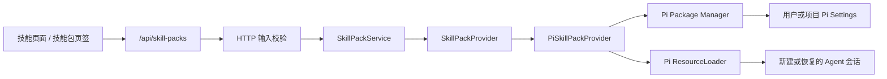

# 技能包：设计、使用与命名说明

## 一句话理解

技能包是一个**可安装、可移除、可按项目或全局生效的 Agent 能力分发单元**。
它底层使用 Pi Package，不只可以包含技能（Skills），还可以包含扩展
（Extensions）、提示词（Prompts）和主题（Themes）。

安装技能包不等于立即执行其中的技能。安装完成后，新建或恢复 Agent 会话时，
Pi 才会加载包内资源；用户可以让模型按任务自动选择技能，也可以用
`/skill:<技能名>` 显式调用。

## 技能与技能包的区别

| 概念 | 解决的问题 | 当前项目中的操作方式 |
| --- | --- | --- |
| 技能（Skill） | 告诉 Agent 如何完成一种具体任务 | 查看、单独导入、控制是否允许模型自动调用 |
| 技能包（Skill Pack） | 安装和分发一组相关资源，并统一管理来源、范围和生命周期 | 安装、更新、修复、移除整个包 |
| Pi Package | 技能包的底层格式和包管理机制 | 由服务端通过 Pi Package Manager 读写 |

一个技能通常是一个包含 `SKILL.md` 的目录；一个技能包可以只有一个技能，也可以
包含多个技能和其他资源。因此，技能包更接近 npm package 或 IDE 插件包，而不是
运行时的“技能分类”。

## 用户可以用它做什么

技能包适合分发需要一起安装、一起升级的 Agent 工作流，例如：

- 为团队统一代码审查、故障排查、发布检查等工程流程；
- 把技能所需的脚本、参考资料和模板随技能一起交付；
- 用项目范围安装团队约定，只影响当前仓库；
- 用全局范围安装个人常用能力，让所有项目都能使用；
- 在一个包中同时交付技能、命令扩展、提示词模板和主题；
- 通过 npm、Git 或本地目录维护版本和来源，而不是逐个复制技能文件。

当前内置的 `Git & Release Workflows` 是最直接的例子，它包含：

- `prepare-release`：检查工作区、Git 范围、版本和验证结果，判断是否具备发布条件；
- `write-release-notes`：根据明确的 Git 范围和仓库证据生成发布说明。

这两个技能负责分析和产出文档，不会自行提交、打标签、推送或发布。

## 当前项目如何设计

### 设计原则

当前实现没有自行发明另一套包格式，而是把 Pi Package Manager 适配到项目既有的
后端分层中。Pi Settings 是“安装了哪些包”的来源，Pi ResourceLoader 是“实际加载了
哪些资源”的来源。前端只展示服务端解析后的安全数据，不直接操作文件或 Pi SDK。



各层职责如下：

- `src/contracts/skill-packs.ts` 定义前后端共享的数据结构；
- `src/app/api/skill-packs` 提供薄 Route Handler；
- `src/server/transport/http/validators.ts` 校验 `cwd`、`packId`、来源和安装范围；
- `SkillPackService` 确保 `cwd` 位于已注册的 Workspace Root；
- `SkillPackProvider` 隔离应用层与 Pi SDK；
- `PiSkillPackProvider` 完成安装、资源解析、健康检查、回滚、更新、修复和移除；
- `src/features/skills` 负责列表、详情、确认对话框和请求并发状态。

### 包列表从哪里来

服务端会合并两类数据：

1. 官方目录：即使尚未安装也会显示为“可安装”；
2. Pi Settings 中已经配置的第三方或本地 Package。

当前官方目录只有 `Git & Release Workflows`。第三方包不会进入官方目录，但安装后会
作为已配置包显示。服务端为每个包生成 opaque `packId`，前端不会拿真实路径或 Package
Source 充当操作标识。

### 状态与生命周期

| 状态 | 含义 | 可执行操作 |
| --- | --- | --- |
| `available` | 官方目录中存在，但尚未安装 | 安装 |
| `installed` | 配置存在，安装目录和启用资源可以正常解析 | 更新、移除；本地目录通过刷新读取改动 |
| `broken` | 配置仍在，但安装目录缺失、资源解析失败或官方要求的技能不完整 | 修复或移除 |

所有安装、更新、修复和移除操作共用一个进程内忙碌锁，避免两个 Package Manager
操作同时改写配置。安装后会重新解析资源；若没有任何启用资源，或官方包缺少声明的
技能，服务端会尝试回滚本次安装。

### 安装范围

- **当前项目**：写入当前工作区的 `.pi/settings.json`，只对该项目生效，适合团队工作流；
- **所有项目**：写入用户级 Pi Settings，通常位于 `~/.pi/agent/settings.json`，适合个人通用能力。

同一个 Package 同时出现在两种范围时，Pi 以项目配置为准。项目范围不是安全沙箱；
它只控制资源在哪些项目中加载。

### 安全边界

技能能够指导模型执行命令，扩展能够运行代码，因此技能包不是静态说明书。当前实现：

- 严格校验 Package Source；
- 拒绝相对本地路径、控制字符、不支持的协议，以及带凭据、查询参数或 fragment 的 URL；
- 返回 Source 前移除 URL 中可能包含的敏感信息；
- 要求操作所用的工作目录位于已注册 Workspace Root；
- 对本地 Package，在 Pi 读取前把其绝对目录注册为允许访问的 Root；
- 安装包含扩展的 Package 时显示额外的可执行代码警告。

这些检查不能替代源码审查。第三方包只应从可信发布者和可信来源安装。

## 在 Po Agent 中使用

### 安装官方技能包

1. 先在左侧选择目标项目。
2. 打开左侧导航中的“技能”。
3. 切换到“技能包”页签。
4. 选择 `Git & Release Workflows`，查看来源、版本和资源列表。
5. 点击“安装”，选择“当前项目”或“所有项目”。
6. 安装成功后新建会话，或恢复会话以重新加载资源。

如果只是当前仓库需要发布流程，优先选择“当前项目”；只有多个项目都需要时才选择
“所有项目”。

### 调用包内技能

安装后切回“技能”页签，可以看到按技能包来源分组的技能。包内技能有两种使用方式：

1. **自动调用**：直接描述任务，模型根据技能的名称和描述决定是否加载；
2. **显式调用**：在聊天输入中使用 `/skill:<技能名>`，明确要求加载该技能。

例如：

```text
/skill:prepare-release
检查版本 1.8.0 是否可以发布，Git 范围是 v1.7.0..HEAD。
```

```text
/skill:write-release-notes
根据 v1.7.0..HEAD 生成发布说明，沿用仓库现有格式。
```

这两个示例都应给出明确、可解析的 Git 范围；技能会把缺失或含糊的关键证据列为阻塞，
不会自行猜测版本和范围。

包管理的技能在“技能”详情中是只读的：不能单独修改模型调用开关，也不能单独删除。
需要更新或移除时，点击“查看技能包”，回到所属包统一操作。这样可以避免 Package
Settings 与磁盘资源失去一致性。

### 从自定义来源安装

在“技能包”页签点击“添加技能包”，可以输入：

```text
npm:@scope/package@1.2.3
git:github.com/example/agent-workflows@v1
https://github.com/example/agent-workflows
ssh://github.com/example/agent-workflows
D:\agent-packs\my-workflows
```

注意：

- npm 来源必须带 `npm:` 前缀；
- Git 使用 `git:` 引用或完整的 `http`、`https`、`ssh`、`git` URL；
- 本地来源必须是已经存在的绝对目录；
- 本地目录不会复制到项目中，Po Agent 会直接读取原目录；
- 相对路径、URL 凭据、查询参数和 fragment 不被接受。

### 更新、修复与移除

- **远程 npm/Git 包**：详情页显示“检查并更新”时，可以让 Pi Package Manager 更新；
- **本地目录包**：直接修改源目录，然后点击“刷新技能包”；本地来源没有更新操作；
- **需要处理**：说明配置仍在但资源不完整，可点击“修复”重新获取或检查原来源；
- **移除**：从原安装范围删除 Package 配置，并重新加载确认。

上述变化不会静默重启正在运行的会话。要让当前聊天使用新资源，应新建会话；恢复会话
或显式执行资源重新加载时也会读取最新配置。

## 创建一个最小技能包

当前项目兼容 Pi Package 的约定目录和 `package.json` 中的 `pi` manifest。只分发技能时，
最小结构如下：

```text
my-workflows/
├── package.json
└── skills/
    └── review-change/
        └── SKILL.md
```

`package.json`：

```json
{
  "name": "@example/my-workflows",
  "version": "1.0.0",
  "keywords": ["pi-package"],
  "pi": {
    "skills": ["./skills"]
  }
}
```

`skills/review-change/SKILL.md`：

```markdown
---
name: review-change
description: Review a code change for correctness and release risk. Use before merging.
---

# Review Change

Read the repository instructions, inspect the complete diff, run the required checks,
and report actionable findings before summarizing the result.
```

开发时可以先用这个目录的绝对路径安装到“当前项目”。确认加载和调用正常后，再决定
是否发布到 npm 或 Git。只有需要非技能资源时，才在 `pi` manifest 中增加
`extensions`、`prompts` 或 `themes`。

## 当前限制

- 官方目录目前只有一个技能包，没有在线市场或目录搜索；
- Web UI 不提供 Package 资源过滤，也不能单独启停包内某项资源；
- 包内技能只能随包管理，不能在“技能”页单独编辑或删除；
- 第三方包详情当前只从 `package.json` 读取名称和版本，不读取描述；
- 本地包直接引用原目录，不具备独立版本快照或一键回滚；
- 安装结果只保证至少解析出一个启用资源，不代表第三方包的行为已经过审计。

## 名称是否应该改成“技能组”

不建议。“技能组”通常表示为了展示、筛选或一次选择而形成的逻辑集合，但当前功能有
明确的来源、版本、安装范围、更新、修复和移除生命周期，而且一个包可以包含非技能
资源。“技能组”会让用户误以为它只是技能列表中的分类，也无法解释只有一个技能的包。

“技能包”比“技能组”更接近真实模型，但仍有轻微歧义：它容易让人以为内容只能是
Skills。候选名称可以这样比较：

| 名称 | 优点 | 问题 |
| --- | --- | --- |
| 技能包 | 与现有 Skill 页面和 `Skill Pack` 术语一致，容易理解 | 弱化了扩展、提示词和主题 |
| 技能组 | 强调多个技能 | 不体现安装分发和版本，也不允许准确描述非技能资源 |
| Pi 资源包 | 最准确地覆盖四类资源 | “资源”较抽象，用户不易判断它能增强 Agent |
| Pi 扩展包 | 有安装和扩展能力的直觉 | 容易与包内的 `Extensions` 类型混淆 |
| Pi 能力包 | 强调为 Agent 增加能力，并能覆盖多类资源 | 需要在首次出现时解释它底层是 Pi Package |

### 建议

用户界面优先使用 **“Pi 能力包”**，首次出现时配一句说明：

> 一次安装技能、扩展、提示词和主题。

如果暂时不希望承担全量改名成本，保留“技能包”也比改成“技能组”更准确，并应在页签
或空状态旁补充上述说明。内部 TypeScript 类型、错误码和 `/api/skill-packs` 可以继续保留
`SkillPack`，等需要发布破坏性 API 版本时再评估迁移；用户文案不必与内部标识同时改名。

## 相关实现

- `resources/official-packs/git-release-workflows`：当前官方技能包；
- `src/server/infrastructure/pi/pi-skill-pack-provider.ts`：Pi Package 适配与生命周期；
- `src/server/infrastructure/pi/pi-resource-loader.ts`：会话资源加载；
- `src/features/skills/skills-page.tsx`：技能与技能包的用户操作入口；
- `docs/agent-api-reference.md`：Skill Pack HTTP 合同和错误码。
