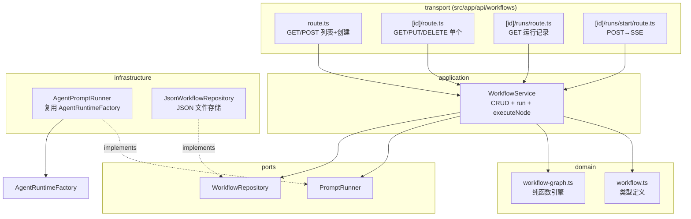

# Workflow 编排 Feature 设计文档

> 状态：已 review，待实现
> 范围：MVP 第一阶段
> 参考：`docs/Po-Agent-Web-Dify-Workflow-借鉴分析.md`

## 1. 架构总览

### 1.1 目标

让用户通过可视化画布编排自己的工作流，将多个 AI 能力节点串联起来，实现创意自动化。MVP 第一阶段聚焦于把"声明式图定义 → 拓扑排序逐节点执行 → 变量池传递 → SSE 流式反馈"这条链路跑通。

### 1.2 MVP 节点类型

| 节点 | 职责 | 执行方式 |
|------|------|----------|
| **Start** | 定义工作流入参，写入变量池 | 纯逻辑（application 层） |
| **Skill** | 调用一个已安装 Skill 完成任务 | PromptRunner（带工具） |
| **LLM** | 纯文本生成，无工具调用 | PromptRunner（无工具） |
| **Output** | 组装最终输出 | 纯逻辑（resolveTemplate） |

### 1.3 核心设计决策

以下决策已在设计 review 中逐项确认：

1. **画布库**：引入 `@xyflow/react`（React Flow v12），支持 React 19。
2. **节点执行**：Skill 节点和 LLM 节点底层都是"创建临时 AgentRuntime → 发 prompt → 采集 `message_end` → 销毁"，区别仅在是否携带工具。因此抽象为**统一的 `PromptRunner` port**，而非按节点类型分拆多个 executor。
3. **存储**：JSON 文件存储在 Pi agent 目录（`~/.pi/agent/workflows/`），与现有 `projects.json` 模式一致，零外部依赖。
4. **UI 集成**：Workflow 作为新的 `WorkspaceView`，与 Chat / Skills 同级，通过左侧导航切换。
5. **运行协议**：`POST /api/workflows/[id]/runs/start` 返回 SSE 流，复用现有 `createSseResponse`。因需要 POST body，前端用 `fetch` + `ReadableStream` 手动解析（`EventSource` 不支持 POST body）。
6. **图引擎**：`validateGraph` / `topoSort` / `resolveTemplate` 均为纯函数，放在 domain 层，可独立单测。

### 1.4 架构依赖图



### 1.5 分层职责映射

遵循项目现有架构（`domain ← ports ← application ← transport`）：

```text
contracts <- domain <- ports <- application
domain/application <- transport
domain/ports <- infrastructure
application/infrastructure <- composition
composition/transport/domain <- app/api
contracts <- features/layouts
```

Workflow feature 纯新增，不修改任何现有模块的业务逻辑，仅在以下三处做最小集成改动：

- `src/layouts/agent-workspace/workspace-navigation.ts` — 新增 `"workflow"` view 类型
- `src/layouts/agent-workspace/workspace-sidebar.tsx` — 新增导航按钮
- `src/layouts/agent-workspace/agent-workspace.tsx` — 新增 view 渲染分支
- `src/server/composition/container.ts` — 注册 `WorkflowService` 及其依赖
- `src/i18n/dictionaries/{en,zh}.ts` — 新增 `workflow` 命名空间

---

## 2. Domain 类型

### 2.1 文件：`src/server/domain/workflow.ts`

```ts
/**
 * Workflow 节点类型枚举。
 * MVP 第一阶段支持四种节点。
 */
export type WorkflowNodeType = "start" | "skill" | "llm" | "output";

/**
 * Start 节点配置：定义工作流入参的键值对。
 * 运行时入参以 Record<string, string> 形式提供，写入变量池。
 */
export interface StartNodeConfig {
  type: "start";
  /** 入参字段定义，key 为字段名，value 为描述 */
  inputs: Record<string, string>;
}

/**
 * Skill 节点配置：调用一个已安装的 Skill。
 * 通过 PromptRunner 执行（携带工具）。
 */
export interface SkillNodeConfig {
  type: "skill";
  /** Skill 标识符 */
  skillId: string;
  /** 发送给 Agent 的 prompt 模板，支持 {{nodeId.field}} 变量引用 */
  prompt: string;
  /** 可选系统提示词模板 */
  systemPrompt?: string;
}

/**
 * LLM 节点配置：纯文本生成，无工具调用。
 * 通过 PromptRunner 执行（无工具）。
 */
export interface LlmNodeConfig {
  type: "llm";
  /** prompt 模板 */
  prompt: string;
  /** 可选系统提示词模板 */
  systemPrompt?: string;
  /** 可选模型覆盖 */
  model?: { provider: string; modelId: string };
}

/**
 * Output 节点配置：组装最终输出。
 */
export interface OutputNodeConfig {
  type: "output";
  /** 输出模板，支持 {{nodeId.field}} 变量引用 */
  template: string;
}

export type WorkflowNodeConfig =
  | StartNodeConfig
  | SkillNodeConfig
  | LlmNodeConfig
  | OutputNodeConfig;

/**
 * Workflow 图节点。对应画布上的一个节点。
 */
export interface WorkflowNode {
  /** 节点唯一标识 */
  id: string;
  /** 节点类型 */
  type: WorkflowNodeType;
  /** 节点配置，按 type 区分 */
  config: WorkflowNodeConfig;
  /** 画布坐标 */
  position: { x: number; y: number };
  /** 节点显示名称 */
  label?: string;
}

/**
 * Workflow 图边。对应画布上的连线。
 */
export interface WorkflowEdge {
  /** 边唯一标识 */
  id: string;
  /** 源节点 id */
  source: string;
  /** 目标节点 id */
  target: string;
}

/**
 * Workflow 定义。一个完整的可执行工作流。
 */
export interface WorkflowDefinition {
  /** 定义唯一标识 */
  id: string;
  /** 显示名称 */
  name: string;
  /** 描述 */
  description?: string;
  /** 图节点列表 */
  nodes: WorkflowNode[];
  /** 图边列表 */
  edges: WorkflowEdge[];
  /** 创建时间 ISO */
  createdAt: string;
  /** 更新时间 ISO */
  updatedAt: string;
}

/**
 * 变量池。运行时存储每个节点的输出，供后续节点引用。
 * key 格式：`{nodeId}`，value 为该节点产出的字段集合。
 */
export type VariablePool = Record<string, Record<string, unknown>>;

/**
 * 节点运行状态。
 */
export type NodeRunStatus =
  | "pending"
  | "running"
  | "completed"
  | "failed"
  | "skipped";

/**
 * 单个节点的运行结果。
 */
export interface NodeRunResult {
  /** 节点 id */
  nodeId: string;
  /** 运行状态 */
  status: NodeRunStatus;
  /** 节点输出（成功时写入变量池的字段集合） */
  output?: Record<string, unknown>;
  /** 错误信息（失败时） */
  error?: string;
  /** 开始时间 ISO */
  startedAt?: string;
  /** 结束时间 ISO */
  finishedAt?: string;
}

/**
 * Workflow 运行 SSE 事件。
 */
export type WorkflowRunEvent =
  | { type: "run_started"; runId: string; workflowId: string }
  | { type: "node_started"; nodeId: string; runId: string }
  | { type: "node_completed"; nodeId: string; runId: string; output: Record<string, unknown> }
  | { type: "node_failed"; nodeId: string; runId: string; error: string }
  | {
      type: "run_completed";
      runId: string;
      output: Record<string, unknown>;
    }
  | { type: "run_failed"; runId: string; error: string };

/**
 * Workflow 运行记录（持久化）。
 */
export interface WorkflowRunRecord {
  /** 运行记录唯一标识 */
  id: string;
  /** 关联的 workflow 定义 id */
  workflowId: string;
  /** 运行时的 workflow 定义快照 */
  snapshot: WorkflowDefinition;
  /** 运行入参 */
  inputs: Record<string, string>;
  /** 运行状态 */
  status: "running" | "completed" | "failed" | "aborted";
  /** 各节点运行结果 */
  nodeResults: NodeRunResult[];
  /** 最终输出（成功时） */
  output?: Record<string, unknown>;
  /** 错误信息（失败时） */
  error?: string;
  /** 开始时间 ISO */
  startedAt: string;
  /** 结束时间 ISO */
  finishedAt?: string;
}
```

### 2.2 文件：`src/server/domain/workflow-graph.ts`

纯函数图引擎，无副作用，可独立单测。

```ts
import type {
  WorkflowDefinition,
  WorkflowEdge,
  WorkflowNode,
  VariablePool,
} from "./workflow";

/**
 * 图校验结果。
 */
export interface GraphValidationResult {
  valid: boolean;
  errors: string[];
}

/**
 * 校验 Workflow 图结构的合法性。
 *
 * 规则：
 * 1. 恰好一个 Start 节点
 * 2. 至少一个 Output 节点
 * 3. 无环（DAG）
 * 4. 无孤立节点（每个非 Start 节点至少有一条入边）
 * 5. 所有边引用的节点必须存在
 */
export function validateGraph(
  nodes: WorkflowNode[],
  edges: WorkflowEdge[],
): GraphValidationResult {
  const errors: string[] = [];
  const nodeIds = new Set(nodes.map((n) => n.id));

  const startNodes = nodes.filter((n) => n.type === "start");
  if (startNodes.length === 0) errors.push("缺少 Start 节点");
  if (startNodes.length > 1) errors.push("只能有一个 Start 节点");

  const outputNodes = nodes.filter((n) => n.type === "output");
  if (outputNodes.length === 0) errors.push("缺少 Output 节点");

  for (const edge of edges) {
    if (!nodeIds.has(edge.source)) errors.push(`边 ${edge.id} 的源节点 ${edge.source} 不存在`);
    if (!nodeIds.has(edge.target)) errors.push(`边 ${edge.id} 的目标节点 ${edge.target} 不存在`);
  }

  // 孤立节点检查：非 Start 节点必须有入边
  const nodesWithIncoming = new Set(edges.map((e) => e.target));
  for (const node of nodes) {
    if (node.type !== "start" && !nodesWithIncoming.has(node.id)) {
      errors.push(`节点 ${node.id} 没有入边（孤立节点）`);
    }
  }

  // 环检测
  if (hasCycle(nodes, edges)) {
    errors.push("图中存在环");
  }

  return { valid: errors.length === 0, errors };
}

/**
 * 检测图中是否存在环（DFS）。
 */
export function hasCycle(
  nodes: WorkflowNode[],
  edges: WorkflowEdge[],
): boolean {
  const adjacency = new Map<string, string[]>();
  for (const node of nodes) adjacency.set(node.id, []);
  for (const edge of edges) adjacency.get(edge.source)?.push(edge.target);

  const WHITE = 0, GRAY = 1, BLACK = 2;
  const color = new Map<string, number>(
    nodes.map((n) => [n.id, WHITE]),
  );

  function dfs(id: string): boolean {
    color.set(id, GRAY);
    for (const neighbor of adjacency.get(id) ?? []) {
      const c = color.get(neighbor);
      if (c === GRAY) return true;
      if (c === WHITE && dfs(neighbor)) return true;
    }
    color.set(id, BLACK);
    return false;
  }

  for (const node of nodes) {
    if (color.get(node.id) === WHITE && dfs(node.id)) return true;
  }
  return false;
}

/**
 * 拓扑排序。返回节点的线性执行顺序。
 * 使用 Kahn 算法（基于入度）。
 */
export function topoSort(
  nodes: WorkflowNode[],
  edges: WorkflowEdge[],
): WorkflowNode[] {
  const inDegree = new Map<string, number>(
    nodes.map((n) => [n.id, 0]),
  );
  const adjacency = new Map<string, string[]>();
  for (const node of nodes) adjacency.set(node.id, []);
  for (const edge of edges) {
    adjacency.get(edge.source)?.push(edge.target);
    inDegree.set(edge.target, (inDegree.get(edge.target) ?? 0) + 1);
  }

  const queue = nodes
    .filter((n) => (inDegree.get(n.id) ?? 0) === 0)
    .map((n) => n.id);
  const nodeMap = new Map(nodes.map((n) => [n.id, n]));
  const result: WorkflowNode[] = [];

  while (queue.length > 0) {
    const id = queue.shift()!;
    const node = nodeMap.get(id);
    if (node) result.push(node);
    for (const neighbor of adjacency.get(id) ?? []) {
      const newDegree = (inDegree.get(neighbor) ?? 1) - 1;
      inDegree.set(neighbor, newDegree);
      if (newDegree === 0) queue.push(neighbor);
    }
  }

  return result;
}

/**
 * 模板解析。将 {{nodeId.field}} 替换为变量池中的值。
 *
 * 支持点号路径：{{start.input1}}、{{skill_1.result}}。
 * 未找到的变量保留原样（或替换为空字符串，由调用方决定）。
 *
 * @param template 模板字符串
 * @param pool 变量池
 * @param keepUnknown 未匹配变量是否保留原文，默认 false（替换为空）
 */
export function resolveTemplate(
  template: string,
  pool: VariablePool,
  keepUnknown = false,
): string {
  return template.replace(/\{\{(\w+)\.(\w+)\}\}/g, (match, nodeId, field) => {
    const nodeOutput = pool[nodeId];
    if (nodeOutput && field in nodeOutput) {
      const value = nodeOutput[field];
      return value !== null && value !== undefined ? String(value) : "";
    }
    return keepUnknown ? match : "";
  });
}
```

---

## 3. Port 与 Application 层

### 3.1 Port：`src/server/ports/prompt-runner.ts`

统一执行 Skill 节点（带工具）和 LLM 节点（无工具）的端口。复用现有 `AgentRuntimeFactory`，底层创建临时 `AgentRuntime`，采集 `message_end` 事件获取 assistant 文本。

```ts
/**
 * Prompt 执行输入。
 */
export interface RunPromptInput {
  /** Agent 工作目录 */
  cwd: string;
  /** 发送给 Agent 的 prompt（已解析变量） */
  prompt: string;
  /** 可选系统提示词 */
  systemPrompt?: string;
  /**
   * 允许使用的工具名称列表。
   * - `undefined`：使用默认全量工具（Skill 节点默认行为）
   * - `[]`（空数组）：无工具模式（LLM 节点行为）
   * - `[...]`：指定工具集
   */
  toolNames?: string[];
  /** 可选模型覆盖 */
  model?: { provider: string; modelId: string };
  /** 超时时间（毫秒），默认 120000 */
  timeoutMs?: number;
}

/**
 * Prompt 执行结果。
 */
export interface RunPromptResult {
  /** Agent 返回的文本内容 */
  text: string;
  /** 是否因超时而终止 */
  timedOut: boolean;
}

/**
 * Prompt 执行端口。
 *
 * 负责创建临时 AgentRuntime、发送 prompt、采集 message_end、销毁实例。
 * Skill 节点传入 toolNames（携带工具），LLM 节点传入空数组（无工具）。
 */
export interface PromptRunner {
  run(input: RunPromptInput): Promise<RunPromptResult>;
}
```

> **设计说明**：之所以用统一的 `PromptRunner` 而非分拆 `SkillExecutor` + `LlmExecutor`，是因为两者底层执行路径完全一致——都是"创建临时 AgentRuntime → 发 prompt → 等待 `message_end` → 取 assistant 文本 → 销毁"。唯一差异是 `toolNames` 参数：Skill 传工具名列表，LLM 传空数组触发 Pi SDK 的 `noTools: "all"` 模式（参见 `PiAgentRuntimeFactory.create` 第 43 行）。

### 3.2 Port：`src/server/ports/workflow-repository.ts`

```ts
import type { WorkflowDefinition, WorkflowRunRecord } from "@/server/domain/workflow";

/**
 * Workflow 持久化端口。
 * 负责 Workflow 定义和运行记录的 CRUD。
 */
export interface WorkflowRepository {
  /** 列出所有 workflow 定义 */
  list(): Promise<WorkflowDefinition[]>;
  /** 根据 id 获取 workflow 定义 */
  get(id: string): Promise<WorkflowDefinition | undefined>;
  /** 创建或更新 workflow 定义 */
  save(workflow: WorkflowDefinition): Promise<void>;
  /** 删除 workflow 定义 */
  delete(id: string): Promise<void>;

  /** 列出指定 workflow 的运行记录 */
  listRuns(workflowId: string): Promise<WorkflowRunRecord[]>;
  /** 获取单条运行记录 */
  getRun(runId: string): Promise<WorkflowRunRecord | undefined>;
  /** 创建或更新运行记录 */
  saveRun(run: WorkflowRunRecord): Promise<void>;
}
```

### 3.3 Application：`src/server/application/workflow-service.ts`

```ts
import type { WorkflowDefinition, WorkflowRunRecord, WorkflowRunEvent, VariablePool } from "@/server/domain/workflow";
import { validateGraph, topoSort, resolveTemplate } from "@/server/domain/workflow-graph";
import type { PromptRunner } from "@/server/ports/prompt-runner";
import type { WorkflowRepository } from "@/server/ports/workflow-repository";

/**
 * 创建 Workflow 的输入。
 */
export interface CreateWorkflowInput {
  name: string;
  description?: string;
}

/**
 * Workflow 应用服务。
 *
 * 编排 workflow 的 CRUD 和运行。
 * 运行时按拓扑顺序逐节点执行，通过 onEvent 回调产出 SSE 事件。
 */
export class WorkflowService {
  constructor(
    private readonly repository: WorkflowRepository,
    private readonly promptRunner: PromptRunner,
  ) {}

  // ---- CRUD ----

  async list(): Promise<WorkflowDefinition[]> {
    return this.repository.list();
  }

  async get(id: string): Promise<WorkflowDefinition> {
    const workflow = await this.repository.get(id);
    if (!workflow) throw new AppError("WORKFLOW_NOT_FOUND", `Workflow ${id} not found`, 404);
    return workflow;
  }

  async create(input: CreateWorkflowInput): Promise<WorkflowDefinition> {
    const now = new Date().toISOString();
    const workflow: WorkflowDefinition = {
      id: crypto.randomUUID(),
      name: input.name,
      description: input.description,
      nodes: [
        { id: "start", type: "start", config: { type: "start", inputs: {} }, position: { x: 100, y: 200 }, label: "Start" },
      ],
      edges: [],
      createdAt: now,
      updatedAt: now,
    };
    await this.repository.save(workflow);
    return workflow;
  }

  async update(id: string, patch: Partial<WorkflowDefinition>): Promise<WorkflowDefinition> {
    const existing = await this.get(id);
    const updated: WorkflowDefinition = {
      ...existing,
      ...patch,
      id: existing.id, // id 不可变
      createdAt: existing.createdAt, // 创建时间不可变
      updatedAt: new Date().toISOString(),
    };
    await this.repository.save(updated);
    return updated;
  }

  async delete(id: string): Promise<void> {
    await this.repository.delete(id);
  }

  // ---- 运行 ----

  async listRuns(workflowId: string): Promise<WorkflowRunRecord[]> {
    return this.repository.listRuns(workflowId);
  }

  /**
   * 运行 workflow。
   *
   * @param workflowId workflow 定义 id
   * @param inputs 入参
   * @param cwd 工作目录
   * @param onEvent SSE 事件回调
   * @returns 运行记录
   */
  async run(
    workflowId: string,
    inputs: Record<string, string>,
    cwd: string,
    onEvent: (event: WorkflowRunEvent) => void,
  ): Promise<WorkflowRunRecord> {
    const workflow = await this.get(workflowId);

    // 1. 校验图
    const validation = validateGraph(workflow.nodes, workflow.edges);
    if (!validation.valid) {
      throw new AppError("WORKFLOW_INVALID", validation.errors.join("; "), 400);
    }

    const runId = crypto.randomUUID();
    const startedAt = new Date().toISOString();
    const pool: VariablePool = {};
    const nodeResults: NodeRunResult[] = [];

    onEvent({ type: "run_started", runId, workflowId });

    try {
      // 2. 拓扑排序
      const ordered = topoSort(workflow.nodes, workflow.edges);

      // 3. 逐节点执行
      for (const node of ordered) {
        const startedAtNode = new Date().toISOString();
        onEvent({ type: "node_started", nodeId: node.id, runId });

        try {
          const output = await this.executeNode(node, pool, inputs, cwd);
          pool[node.id] = output;
          const result: NodeRunResult = {
            nodeId: node.id,
            status: "completed",
            output,
            startedAt: startedAtNode,
            finishedAt: new Date().toISOString(),
          };
          nodeResults.push(result);
          onEvent({ type: "node_completed", nodeId: node.id, runId, output });
        } catch (error) {
          const message = error instanceof Error ? error.message : String(error);
          nodeResults.push({
            nodeId: node.id,
            status: "failed",
            error: message,
            startedAt: startedAtNode,
            finishedAt: new Date().toISOString(),
          });
          onEvent({ type: "node_failed", nodeId: node.id, runId, error: message });
          throw error; // 节点失败则终止运行
        }
      }

      // 4. 收集输出节点的结果
      const outputNode = workflow.nodes.find((n) => n.type === "output");
      const finalOutput = outputNode ? pool[outputNode.id] ?? {} : {};

      const record: WorkflowRunRecord = {
        id: runId,
        workflowId,
        snapshot: workflow,
        inputs,
        status: "completed",
        nodeResults,
        output: finalOutput,
        startedAt,
        finishedAt: new Date().toISOString(),
      };
      await this.repository.saveRun(record);
      onEvent({ type: "run_completed", runId, output: finalOutput });
      return record;
    } catch (error) {
      const message = error instanceof Error ? error.message : String(error);
      const record: WorkflowRunRecord = {
        id: runId,
        workflowId,
        snapshot: workflow,
        inputs,
        status: "failed",
        nodeResults,
        error: message,
        startedAt,
        finishedAt: new Date().toISOString(),
      };
      await this.repository.saveRun(record);
      onEvent({ type: "run_failed", runId, error: message });
      return record;
    }
  }

  /**
   * 执行单个节点（内部分派）。
   */
  private async executeNode(
    node: WorkflowNode,
    pool: VariablePool,
    inputs: Record<string, string>,
    cwd: string,
  ): Promise<Record<string, unknown>> {
    switch (node.config.type) {
      case "start": {
        // Start 节点：将入参写入变量池
        return { ...inputs };
      }
      case "skill": {
        const prompt = resolveTemplate(node.config.prompt, pool);
        const result = await this.promptRunner.run({
          cwd,
          prompt: `使用 skill "${node.config.skillId}" 完成以下任务：\n\n${prompt}`,
          systemPrompt: node.config.systemPrompt
            ? resolveTemplate(node.config.systemPrompt, pool)
            : undefined,
        });
        return { result: result.text };
      }
      case "llm": {
        const prompt = resolveTemplate(node.config.prompt, pool);
        const result = await this.promptRunner.run({
          cwd,
          prompt,
          systemPrompt: node.config.systemPrompt
            ? resolveTemplate(node.config.systemPrompt, pool)
            : undefined,
          toolNames: [], // LLM 节点无工具
          model: node.config.model,
        });
        return { result: result.text };
      }
      case "output": {
        const text = resolveTemplate(node.config.template, pool);
        return { output: text };
      }
      default:
        throw new AppError("WORKFLOW_INVALID", `未知节点类型: ${(node.config as { type: string }).type}`, 400);
    }
  }
}
```

> **新增 AppErrorCode**：在 `src/server/domain/app-error.ts` 的 `AppErrorCode` 联合类型中新增 `"WORKFLOW_NOT_FOUND"` 和 `"WORKFLOW_INVALID"`。

---

## 4. Infrastructure 层

### 4.1 `src/server/infrastructure/filesystem/json-workflow-repository.ts`

JSON 文件实现，与 `JsonProjectRepository` 模式一致。原子写入 + 文件锁保证并发安全。

```ts
import fs from "node:fs/promises";
import path from "node:path";
import { getAgentDir } from "@earendil-works/pi-coding-agent";
import type { WorkflowDefinition, WorkflowRunRecord } from "@/server/domain/workflow";
import type { WorkflowRepository } from "@/server/ports/workflow-repository";

/**
 * 基于 JSON 文件的 Workflow 仓库实现。
 *
 * 存储布局：
 *   ~/.pi/agent/workflows/
 *     workflows/
 *       {id}.json      — 单个 workflow 定义
 *     runs/
 *       {runId}.json   — 单条运行记录
 *
 * 写入使用临时文件 + rename 实现原子性。
 */
export class JsonWorkflowRepository implements WorkflowRepository {
  private readonly workflowsDir: string;
  private readonly runsDir: string;
  private readonly lock = new Map<string, Promise<void>>();

  constructor(baseDir?: string) {
    const root = baseDir ?? path.join(getAgentDir(), "workflows");
    this.workflowsDir = path.join(root, "workflows");
    this.runsDir = path.join(root, "runs");
  }

  private async ensureDirs(): Promise<void> {
    await fs.mkdir(this.workflowsDir, { recursive: true });
    await fs.mkdir(this.runsDir, { recursive: true });
  }

  private async withLock<T>(key: string, fn: () => Promise<T>): Promise<T> {
    const previous = this.lock.get(key) ?? Promise.resolve();
    let resolve: () => void = () => {};
    this.lock.set(key, new Promise<void>((r) => (resolve = r)));
    await previous;
    try {
      return await fn();
    } finally {
      resolve();
      this.lock.delete(key);
    }
  }

  private async atomicWrite(filePath: string, data: string): Promise<void> {
    const tmp = filePath + ".tmp";
    await fs.writeFile(tmp, data, "utf-8");
    await fs.rename(tmp, filePath);
  }

  async list(): Promise<WorkflowDefinition[]> {
    await this.ensureDirs();
    const files = await fs.readdir(this.workflowsDir);
    const results: WorkflowDefinition[] = [];
    for (const file of files) {
      if (!file.endsWith(".json")) continue;
      const content = await fs.readFile(path.join(this.workflowsDir, file), "utf-8");
      results.push(JSON.parse(content));
    }
    return results.sort((a, b) => b.updatedAt.localeCompare(a.updatedAt));
  }

  async get(id: string): Promise<WorkflowDefinition | undefined> {
    try {
      const content = await fs.readFile(
        path.join(this.workflowsDir, `${id}.json`),
        "utf-8",
      );
      return JSON.parse(content);
    } catch {
      return undefined;
    }
  }

  async save(workflow: WorkflowDefinition): Promise<void> {
    await this.ensureDirs();
    await this.withLock(workflow.id, () =>
      this.atomicWrite(
        path.join(this.workflowsDir, `${workflow.id}.json`),
        JSON.stringify(workflow, null, 2),
      ),
    );
  }

  async delete(id: string): Promise<void> {
    await fs.unlink(path.join(this.workflowsDir, `${id}.json`)).catch(() => {});
  }

  async listRuns(workflowId: string): Promise<WorkflowRunRecord[]> {
    await this.ensureDirs();
    const files = await fs.readdir(this.runsDir);
    const results: WorkflowRunRecord[] = [];
    for (const file of files) {
      if (!file.endsWith(".json")) continue;
      const content = await fs.readFile(path.join(this.runsDir, file), "utf-8");
      const record: WorkflowRunRecord = JSON.parse(content);
      if (record.workflowId === workflowId) results.push(record);
    }
    return results.sort((a, b) => b.startedAt.localeCompare(a.startedAt));
  }

  async getRun(runId: string): Promise<WorkflowRunRecord | undefined> {
    try {
      const content = await fs.readFile(
        path.join(this.runsDir, `${runId}.json`),
        "utf-8",
      );
      return JSON.parse(content);
    } catch {
      return undefined;
    }
  }

  async saveRun(run: WorkflowRunRecord): Promise<void> {
    await this.ensureDirs();
    await this.withLock(run.id, () =>
      this.atomicWrite(
        path.join(this.runsDir, `${run.id}.json`),
        JSON.stringify(run, null, 2),
      ),
    );
  }
}
```

### 4.2 `src/server/infrastructure/runtime/agent-prompt-runner.ts`

`PromptRunner` 的 Pi SDK 实现。复用 `AgentRuntimeFactory` 创建临时实例，订阅事件采集 `message_end`，超时用 `Promise.race`。

```ts
import type { AgentEvent } from "@/server/domain/agent-event";
import type { AgentRuntimeFactory } from "@/server/ports/agent-runtime";
import type {
  PromptRunner,
  RunPromptInput,
  RunPromptResult,
} from "@/server/ports/prompt-runner";

/**
 * 基于 AgentRuntimeFactory 的 PromptRunner 实现。
 *
 * 执行流程：
 * 1. 调用 factory.create() 创建临时 AgentRuntime
 * 2. 订阅事件流，等待 message_end 事件采集 assistant 文本
 * 3. 发送 prompt 命令
 * 4. 等待完成或超时
 * 5. 销毁实例
 */
export class AgentPromptRunner implements PromptRunner {
  constructor(private readonly factory: AgentRuntimeFactory) {}

  async run(input: RunPromptInput): Promise<RunPromptResult> {
    const runtime = await this.factory.create({
      cwd: input.cwd,
      toolNames: input.toolNames,
    });

    try {
      let assistantText = "";
      let resolveDone: () => void;
      let rejectDone: (error: Error) => void;
      const done = new Promise<string>((resolve, reject) => {
        resolveDone = () => resolve(assistantText);
        rejectDone = reject;
      });

      const unsubscribe = runtime.subscribe((event: AgentEvent) => {
        if (event.type === "message_end" && event.message.role === "assistant") {
          assistantText = event.message.content ?? "";
          resolveDone();
        }
        if (event.type === "agent_error") {
          rejectDone(new Error(event.error.message));
        }
      });

      // 发送 prompt
      await runtime.execute({ type: "prompt", message: input.prompt });

      // 等待完成或超时
      const timeoutMs = input.timeoutMs ?? 120_000;
      let timedOut = false;
      const timeout = new Promise<never>((_, reject) => {
        setTimeout(() => {
          timedOut = true;
          reject(new Error(`Prompt 执行超时（${timeoutMs}ms）`));
        }, timeoutMs);
      });

      let text: string;
      try {
        text = await Promise.race([done, timeout]);
      } catch (error) {
        // 超时或错误时尝试 abort
        await runtime.execute({ type: "abort" }).catch(() => {});
        return {
          text: assistantText,
          timedOut,
        };
      } finally {
        unsubscribe();
      }

      return { text, timedOut: false };
    } finally {
      runtime.destroy();
    }
  }
}
```

> **关键细节**：`message_end` 事件的 `message.content` 字段取自 `mapPiMessage` 映射后的 `AgentMessage`（参见 `pi-agent-runtime.ts` 第 378-379 行）。assistant 消息的文本内容在此字段中。如果 `agent_error` 事件先到达（Pi SDK 在 `message_end` 且 `message.failure` 存在时会追加 `agent_error`，参见 `mapEvents` 第 347-358 行），则走 reject 路径。

### 4.3 Composition 注册：`src/server/composition/container.ts`

在 `createContainer()` 中新增：

```ts
import { WorkflowService } from "@/server/application/workflow-service";
import { JsonWorkflowRepository } from "@/server/infrastructure/filesystem/json-workflow-repository";
import { AgentPromptRunner } from "@/server/infrastructure/runtime/agent-prompt-runner";

// 在 createContainer 内部：
const workflowRepository = new JsonWorkflowRepository();
const promptRunner = new AgentPromptRunner(runtimeFactory);

return {
  // ...existing services
  workflowService: new WorkflowService(workflowRepository, promptRunner),
};
```

---

## 5. Transport / API 层

### 5.1 HTTP 合同：`src/contracts/workflow.ts`

```ts
/** Workflow 定义 DTO（前端 ↔ 服务端） */
export interface WorkflowDto {
  id: string;
  name: string;
  description?: string;
  nodes: WorkflowNodeDto[];
  edges: WorkflowEdgeDto[];
  createdAt: string;
  updatedAt: string;
}

export interface WorkflowNodeDto {
  id: string;
  type: "start" | "skill" | "llm" | "output";
  config: Record<string, unknown>;
  position: { x: number; y: number };
  label?: string;
}

export interface WorkflowEdgeDto {
  id: string;
  source: string;
  target: string;
}

/** 创建 workflow 请求 */
export interface CreateWorkflowRequest {
  name: string;
  description?: string;
}

/** 更新 workflow 请求 */
export interface UpdateWorkflowRequest {
  name?: string;
  description?: string;
  nodes?: WorkflowNodeDto[];
  edges?: WorkflowEdgeDto[];
}

/** Workflow 运行记录 DTO */
export interface WorkflowRunDto {
  id: string;
  workflowId: string;
  status: "running" | "completed" | "failed" | "aborted";
  nodeResults: NodeRunResultDto[];
  output?: Record<string, unknown>;
  error?: string;
  startedAt: string;
  finishedAt?: string;
}

export interface NodeRunResultDto {
  nodeId: string;
  status: "pending" | "running" | "completed" | "failed" | "skipped";
  output?: Record<string, unknown>;
  error?: string;
  startedAt?: string;
  finishedAt?: string;
}

/** 启动运行请求 */
export interface StartRunRequest {
  inputs: Record<string, string>;
  cwd: string;
}

/** SSE 事件类型（与 domain WorkflowRunEvent 对齐，但为可序列化 DTO） */
export type WorkflowRunSseEvent =
  | { type: "run_started"; runId: string; workflowId: string }
  | { type: "node_started"; nodeId: string; runId: string }
  | { type: "node_completed"; nodeId: string; runId: string; output: Record<string, unknown> }
  | { type: "node_failed"; nodeId: string; runId: string; error: string }
  | { type: "run_completed"; runId: string; output: Record<string, unknown> }
  | { type: "run_failed"; runId: string; error: string }
  | { type: "error"; message: string };
```

### 5.2 校验器：`src/server/transport/http/workflow-validators.ts`

复用现有 `asObject` / `requiredString` / `optionalString` 等工具函数。

```ts
import type {
  CreateWorkflowRequest,
  UpdateWorkflowRequest,
  StartRunRequest,
  WorkflowNodeDto,
  WorkflowEdgeDto,
} from "@/contracts/workflow";
import { AppError } from "@/server/domain/app-error";
import { asObject, requiredString, optionalString } from "./validators";

export function parseCreateWorkflow(value: unknown): CreateWorkflowRequest {
  const object = asObject(value);
  return {
    name: requiredString(object, "name"),
    description: optionalString(object, "description"),
  };
}

export function parseUpdateWorkflow(value: unknown): UpdateWorkflowRequest {
  const object = asObject(value);
  return {
    name: optionalString(object, "name"),
    description: optionalString(object, "description"),
    nodes: object.nodes !== undefined ? parseNodes(object.nodes) : undefined,
    edges: object.edges !== undefined ? parseEdges(object.edges) : undefined,
  };
}

export function parseStartRun(value: unknown): StartRunRequest {
  const object = asObject(value);
  const inputs = object.inputs;
  if (typeof inputs !== "object" || inputs === null || Array.isArray(inputs)) {
    throw new AppError("VALIDATION_ERROR", "inputs must be an object", 400);
  }
  return {
    inputs: Object.fromEntries(
      Object.entries(inputs).map(([k, v]) => [k, String(v)]),
    ),
    cwd: requiredString(object, "cwd"),
  };
}

function parseNodes(value: unknown): WorkflowNodeDto[] {
  if (!Array.isArray(value)) throw new AppError("VALIDATION_ERROR", "nodes must be an array", 400);
  return value.map((item, i) => {
    const node = asObject(item, `nodes[${i}]`);
    const type = requiredString(node, "type");
    if (!["start", "skill", "llm", "output"].includes(type)) {
      throw new AppError("VALIDATION_ERROR", `nodes[${i}].type is invalid`, 400);
    }
    const position = asObject(node.position, `nodes[${i}].position`);
    return {
      id: requiredString(node, "id"),
      type: type as WorkflowNodeDto["type"],
      config: asObject(node.config, `nodes[${i}].config`),
      position: {
        x: typeof position.x === "number" ? position.x : 0,
        y: typeof position.y === "number" ? position.y : 0,
      },
      label: optionalString(node, "label"),
    };
  });
}

function parseEdges(value: unknown): WorkflowEdgeDto[] {
  if (!Array.isArray(value)) throw new AppError("VALIDATION_ERROR", "edges must be an array", 400);
  return value.map((item, i) => {
    const edge = asObject(item, `edges[${i}]`);
    return {
      id: requiredString(edge, "id"),
      source: requiredString(edge, "source"),
      target: requiredString(edge, "target"),
    };
  });
}
```

### 5.3 API 路由

#### `src/app/api/workflows/route.ts`

```ts
import type { WorkflowDto } from "@/contracts/workflow";
import { container } from "@/server/composition/container";
import { handleRoute, json } from "@/server/transport/http/api-response";
import { readJson } from "@/server/transport/http/api-response";
import { parseCreateWorkflow } from "@/server/transport/http/workflow-validators";
import { mapWorkflowToDto } from "./_mapping";

export const runtime = "nodejs";
export const dynamic = "force-dynamic";

export async function GET() {
  return handleRoute<WorkflowDto[]>(async () => {
    const workflows = await container.workflowService.list();
    return workflows.map(mapWorkflowToDto);
  });
}

export async function POST(request: Request) {
  return handleRoute<WorkflowDto>(async () => {
    const input = parseCreateWorkflow(await readJson(request));
    const workflow = await container.workflowService.create(input);
    return mapWorkflowToDto(workflow);
  });
}
```

#### `src/app/api/workflows/[id]/route.ts`

```ts
import { container } from "@/server/composition/container";
import { handleRoute } from "@/server/transport/http/api-response";
import { readJson } from "@/server/transport/http/api-response";
import { parseUpdateWorkflow } from "@/server/transport/http/workflow-validators";
import { mapWorkflowToDto } from "../_mapping";

export const runtime = "nodejs";
export const dynamic = "force-dynamic";

type Context = { params: Promise<{ id: string }> };

export async function GET(_request: Request, context: Context) {
  const { id } = await context.params;
  return handleRoute(async () =>
    mapWorkflowToDto(await container.workflowService.get(id)),
  );
}

export async function PUT(request: Request, context: Context) {
  const { id } = await context.params;
  return handleRoute(async () => {
    const patch = parseUpdateWorkflow(await readJson(request));
    return mapWorkflowToDto(await container.workflowService.update(id, patch));
  });
}

export async function DELETE(_request: Request, context: Context) {
  const { id } = await context.params;
  return handleRoute(async () => {
    await container.workflowService.delete(id);
    return { success: true };
  });
}
```

#### `src/app/api/workflows/[id]/runs/route.ts`

```ts
import { container } from "@/server/composition/container";
import { handleRoute } from "@/server/transport/http/api-response";
import { mapRunToDto } from "../../_mapping";

export const runtime = "nodejs";
export const dynamic = "force-dynamic";

type Context = { params: Promise<{ id: string }> };

export async function GET(_request: Request, context: Context) {
  const { id } = await context.params;
  return handleRoute(async () => {
    const runs = await container.workflowService.listRuns(id);
    return runs.map(mapRunToDto);
  });
}
```

#### `src/app/api/workflows/[id]/runs/start/route.ts`（SSE 运行端点）

```ts
import type { WorkflowRunSseEvent } from "@/contracts/workflow";
import { container } from "@/server/composition/container";
import { readJson } from "@/server/transport/http/api-response";
import { createSseResponse } from "@/server/transport/sse/sse-stream";
import { parseStartRun } from "@/server/transport/http/workflow-validators";

export const runtime = "nodejs";
export const dynamic = "force-dynamic";

type Context = { params: Promise<{ id: string }> };

export async function POST(request: Request, context: Context) {
  const { id } = await context.params;
  const { inputs, cwd } = parseStartRun(await readJson(request));

  return createSseResponse<WorkflowRunSseEvent>({
    request,
    eventName: "workflow",
    subscribe: async (emit) => {
      await container.workflowService.run(id, inputs, cwd, emit);
    },
  });
}
```

> **SSE 复用说明**：`createSseResponse` 已封装心跳（25s `:\n\n`）、客户端断连检测（`request.signal.abort`）、异常捕获（自动 emit `error` 事件并关闭）。运行端点只需把 `emit` 作为 `onEvent` 回调传入 `WorkflowService.run`。`createSseResponse` 的 `subscribe` 返回的 cleanup 函数可选，workflow 运行是自终止的（拓扑排序执行完毕即结束），无需显式 cleanup。

### 5.4 Mapping：`src/app/api/workflows/_mapping.ts`

domain ↔ DTO 映射函数，避免在路由中内联映射逻辑。

```ts
import type { WorkflowDefinition, WorkflowRunRecord } from "@/server/domain/workflow";
import type { WorkflowDto, WorkflowRunDto } from "@/contracts/workflow";

export function mapWorkflowToDto(wf: WorkflowDefinition): WorkflowDto {
  return {
    id: wf.id,
    name: wf.name,
    description: wf.description,
    nodes: wf.nodes.map((n) => ({
      id: n.id,
      type: n.type,
      config: n.config as Record<string, unknown>,
      position: n.position,
      label: n.label,
    })),
    edges: wf.edges,
    createdAt: wf.createdAt,
    updatedAt: wf.updatedAt,
  };
}

export function mapRunToDto(run: WorkflowRunRecord): WorkflowRunDto {
  return {
    id: run.id,
    workflowId: run.workflowId,
    status: run.status,
    nodeResults: run.nodeResults,
    output: run.output,
    error: run.error,
    startedAt: run.startedAt,
    finishedAt: run.finishedAt,
  };
}
```

---

## 6. 前端 Feature 架构

### 6.1 目录结构

```text
src/features/workflow/
├── api.ts                    # API 客户端（fetch 封装）
├── types.ts                  # 前端类型（从 contracts 重新导出 + UI 专用类型）
├── use-workflows.ts          # workflow 列表 CRUD hook
├── use-workflow-editor.ts    # 画布编辑状态 hook（选中节点、连线、保存）
├── use-workflow-run.ts       # 运行状态 hook（SSE 采集、nodeStates 同步）
├── workflow-page.tsx         # 顶层页面（Server Component 容器）
├── workflow-editor.tsx       # 编辑器主组件（画布 + 侧边面板）
├── canvas/
│   ├── workflow-canvas.tsx   # React Flow 画布封装
│   ├── node-registry.tsx     # 节点类型注册（type → component 映射）
│   ├── start-node.tsx        # Start 节点渲染
│   ├── skill-node.tsx        # Skill 节点渲染
│   ├── llm-node.tsx          # LLM 节点渲染
│   ├── output-node.tsx       # Output 节点渲染
│   └── node-toolbar.tsx      # 节点工具栏（删除、复制）
├── panels/
│   ├── node-config-panel.tsx # 节点配置面板（按类型切换表单）
│   ├── start-config.tsx      # Start 配置表单
│   ├── skill-config.tsx      # Skill 配置表单
│   ├── llm-config.tsx        # LLM 配置表单
│   └── output-config.tsx     # Output 配置表单
└── run/
    ├── run-panel.tsx         # 运行面板（入参输入 + 启动按钮 + 结果）
    └── run-status-bar.tsx    # 运行状态条（节点状态实时高亮）
```

### 6.2 API 客户端：`src/features/workflow/api.ts`

```ts
import type {
  WorkflowDto,
  CreateWorkflowRequest,
  UpdateWorkflowRequest,
  WorkflowRunDto,
  WorkflowRunSseEvent,
} from "@/contracts/workflow";

const BASE = "/api/workflows";

async function parseResponse<T>(res: Response): Promise<T> {
  if (!res.ok) {
    const body = await res.json().catch(() => ({}));
    throw new Error(body?.error?.message ?? `HTTP ${res.status}`);
  }
  return res.json() as Promise<T>;
}

export const workflowApi = {
  async list(): Promise<WorkflowDto[]> {
    return parseResponse(await fetch(BASE));
  },
  async create(input: CreateWorkflowRequest): Promise<WorkflowDto> {
    return parseResponse(
      await fetch(BASE, {
        method: "POST",
        headers: { "Content-Type": "application/json" },
        body: JSON.stringify(input),
      }),
    );
  },
  async get(id: string): Promise<WorkflowDto> {
    return parseResponse(await fetch(`${BASE}/${id}`));
  },
  async update(id: string, patch: UpdateWorkflowRequest): Promise<WorkflowDto> {
    return parseResponse(
      await fetch(`${BASE}/${id}`, {
        method: "PUT",
        headers: { "Content-Type": "application/json" },
        body: JSON.stringify(patch),
      }),
    );
  },
  async delete(id: string): Promise<void> {
    await fetch(`${BASE}/${id}`, { method: "DELETE" });
  },
  async listRuns(id: string): Promise<WorkflowRunDto[]> {
    return parseResponse(await fetch(`${BASE}/${id}/runs`));
  },

  /**
   * 启动运行并返回 SSE 事件流。
   * 使用 fetch + ReadableStream 手动解析（EventSource 不支持 POST body）。
   */
  startRun(
    id: string,
    inputs: Record<string, string>,
    cwd: string,
    onEvent: (event: WorkflowRunSseEvent) => void,
    onError: (error: Error) => void,
  ): AbortController {
    const controller = new AbortController();
    (async () => {
      const res = await fetch(`${BASE}/${id}/runs/start`, {
        method: "POST",
        headers: { "Content-Type": "application/json" },
        body: JSON.stringify({ inputs, cwd }),
        signal: controller.signal,
      });
      if (!res.ok || !res.body) {
        onError(new Error(`HTTP ${res.status}`));
        return;
      }
      const reader = res.body.getReader();
      const decoder = new TextDecoder();
      let buffer = "";
      while (true) {
        const { done, value } = await reader.read();
        if (done) break;
        buffer += decoder.decode(value, { stream: true });
        // SSE 以双换行分隔事件
        const events = buffer.split("\n\n");
        buffer = events.pop() ?? "";
        for (const block of events) {
          const dataLine = block
            .split("\n")
            .find((l) => l.startsWith("data: "));
          if (dataLine) {
            try {
              onEvent(JSON.parse(dataLine.slice(6)));
            } catch {
              // 跳过无法解析的事件（如心跳 `:` 行）
            }
          }
        }
      }
    })().catch((err) => {
      if (err.name !== "AbortError") onError(err);
    });
    return controller;
  },
};
```

### 6.3 运行 Hook：`src/features/workflow/use-workflow-run.ts`

```ts
"use client";

import { useCallback, useRef, useState } from "react";
import type { WorkflowRunSseEvent } from "@/contracts/workflow";
import { workflowApi } from "./api";

export type NodeRunState = "idle" | "running" | "completed" | "failed";

export interface WorkflowRunState {
  status: "idle" | "running" | "completed" | "failed";
  nodeStates: Record<string, NodeRunState>;
  output?: Record<string, unknown>;
  error?: string;
}

/**
 * Workflow 运行状态管理 hook。
 *
 * 采集 SSE 事件，将节点状态同步到画布高亮。
 */
export function useWorkflowRun(workflowId: string) {
  const [state, setState] = useState<WorkflowRunState>({
    status: "idle",
    nodeStates: {},
  });
  const abortRef = useRef<AbortController | null>(null);

  const start = useCallback(
    (inputs: Record<string, string>, cwd: string) => {
      setState({ status: "running", nodeStates: {} });
      abortRef.current = workflowApi.startRun(
        workflowId,
        inputs,
        cwd,
        (event: WorkflowRunSseEvent) => {
          setState((prev) => {
            const nodeStates = { ...prev.nodeStates };
            switch (event.type) {
              case "node_started":
                nodeStates[event.nodeId] = "running";
                break;
              case "node_completed":
                nodeStates[event.nodeId] = "completed";
                break;
              case "node_failed":
                nodeStates[event.nodeId] = "failed";
                break;
              case "run_completed":
                return { status: "completed", nodeStates, output: event.output };
              case "run_failed":
                return { status: "failed", nodeStates, error: event.error };
              case "error":
                return { status: "failed", nodeStates, error: event.message };
            }
            return { ...prev, nodeStates };
          });
        },
        (error) => {
          setState((prev) => ({ ...prev, status: "failed", error: error.message }));
        },
      );
    },
    [workflowId],
  );

  const abort = useCallback(() => {
    abortRef.current?.abort();
    setState((prev) => ({ ...prev, status: "idle" }));
  }, []);

  const reset = useCallback(() => {
    setState({ status: "idle", nodeStates: {} });
  }, []);

  return { state, start, abort, reset };
}
```

### 6.4 画布 Hook：`src/features/workflow/use-workflow-editor.ts`

```ts
"use client";

import { useCallback, useEffect, useState } from "react";
import {
  type Edge,
  type Node,
  type OnNodesChange,
  type OnEdgesChange,
  type OnConnect,
  applyNodeChanges,
  applyEdgeChanges,
  addEdge,
} from "@xyflow/react";
import type { WorkflowDto } from "@/contracts/workflow";
import { workflowApi } from "./api";

/**
 * 画布编辑状态 hook。
 *
 * 管理 React Flow 的 nodes/edges，并自动防抖保存到后端。
 */
export function useWorkflowEditor(workflowId: string, initial: WorkflowDto) {
  const [nodes, setNodes] = useState<Node[]>(dtoNodesToRf(initial.nodes));
  const [edges, setEdges] = useState<Edge[]>(dtoEdgesToRf(initial.edges));
  const [dirty, setDirty] = useState(false);
  const [saving, setSaving] = useState(false);

  const onNodesChange: OnNodesChange = useCallback(
    (changes) => setNodes((nds) => applyNodeChanges(changes, nds)),
    [],
  );
  const onEdgesChange: OnEdgesChange = useCallback(
    (changes) => setEdges((eds) => applyEdgeChanges(changes, eds)),
    [],
  );
  const onConnect: OnConnect = useCallback(
    (connection) => setEdges((eds) => addEdge(connection, eds)),
    [],
  );

  // 防抖保存
  useEffect(() => {
    if (!dirty) return;
    const timer = setTimeout(async () => {
      setSaving(true);
      try {
        await workflowApi.update(workflowId, {
          nodes: rfNodesToDto(nodes),
          edges: rfEdgesToDto(edges),
        });
        setDirty(false);
      } finally {
        setSaving(false);
      }
    }, 1000);
    return () => clearTimeout(timer);
  }, [dirty, nodes, edges, workflowId]);

  const markDirty = useCallback(() => setDirty(true), []);

  return {
    nodes,
    edges,
    saving,
    onNodesChange: (c) => { onNodesChange(c); markDirty(); },
    onEdgesChange: (c) => { onEdgesChange(c); markDirty(); },
    onConnect: (c) => { onConnect(c); markDirty(); },
  };
}

// DTO ↔ React Flow 类型映射函数省略，结构一致仅字段名不同
function dtoNodesToRf(nodes: WorkflowDto["nodes"]): Node[] { /* ... */ return []; }
function dtoEdgesToRf(edges: WorkflowDto["edges"]): Edge[] { /* ... */ return []; }
function rfNodesToDto(nodes: Node[]): WorkflowDto["nodes"] { /* ... */ return []; }
function rfEdgesToDto(edges: Edge[]): WorkflowDto["edges"] { /* ... */ return []; }
```

### 6.5 画布组件：`src/features/workflow/canvas/workflow-canvas.tsx`

```tsx
"use client";

import { ReactFlow, Background, Controls, MiniMap } from "@xyflow/react";
import "@xyflow/react/dist/style.css";
import { nodeTypes } from "./node-registry";

interface WorkflowCanvasProps {
  nodes: Node[];
  edges: Edge[];
  onNodesChange: OnNodesChange;
  onEdgesChange: OnEdgesChange;
  onConnect: OnConnect;
  nodeStates?: Record<string, string>;
}

export function WorkflowCanvas(props: WorkflowCanvasProps) {
  return (
    <ReactFlow
      nodes={props.nodes}
      edges={props.edges}
      nodeTypes={nodeTypes}
      onNodesChange={props.onNodesChange}
      onEdgesChange={props.onEdgesChange}
      onConnect={props.onConnect}
      fitView
    >
      <Background />
      <Controls />
      <MiniMap />
    </ReactFlow>
  );
}
```

> **节点状态高亮**：各节点组件通过 `node.data.runState` 读取运行状态，渲染边框颜色（idle=默认、running=蓝色脉动、completed=绿色、failed=红色）。`use-workflow-editor` 在每次 `nodeStates` 更新时同步到对应 `node.data`。

### 6.6 WorkspaceView 集成

#### `src/layouts/agent-workspace/workspace-navigation.ts`

```ts
// 修改：
export type WorkspaceView = "chat" | "model-provider" | "skills" | "workflow";
```

#### `src/layouts/agent-workspace/workspace-sidebar.tsx`

新增 workflow 导航按钮，与 skills 按钮同级。

#### `src/layouts/agent-workspace/agent-workspace.tsx`

```tsx
// 新增渲染分支：
{view === "workflow" && <WorkflowPage />}
```

`WorkflowPage` 作为 Server Component 容器，加载 workflow 列表后渲染 `WorkflowEditor`。

### 6.7 i18n

在 `src/i18n/dictionaries/en.ts` 和 `zh.ts` 中新增 `workflow` 命名空间：

```ts
workflow: {
  title: "Workflows",         // zh: "工作流"
  create: "New Workflow",     // zh: "新建工作流"
  empty: "No workflows yet",  // zh: "暂无工作流"
  run: "Run",                 // zh: "运行"
  running: "Running...",      // zh: "运行中..."
  // ... 节点名称、面板标签、状态文案等
},
```

---

## 7. 测试与实现路线图

### 7.1 测试策略

| 层级 | 测试范围 | 工具 |
|------|----------|------|
| **Domain（纯函数）** | `validateGraph`（各种非法图）、`hasCycle`（有环/无环）、`topoSort`（顺序正确性）、`resolveTemplate`（变量替换/未匹配/嵌套） | Vitest 单测 |
| **Application** | `WorkflowService.run` 桩 `PromptRunner` 和 `WorkflowRepository`，验证拓扑执行顺序、变量池传递、节点失败终止、SSE 事件序列 | Vitest + mock |
| **Infrastructure** | `JsonWorkflowRepository`（临时目录、原子写入、并发锁）、`AgentPromptRunner`（桩 `AgentRuntimeFactory`，验证 message_end 采集、超时、destroy 调用） | Vitest + tmpdir |
| **Transport** | `parseCreateWorkflow` / `parseUpdateWorkflow` / `parseStartRun` 校验器（合法/非法输入）、SSE 端点生命周期（正常完成、节点失败、客户端断连） | Vitest |
| **前端** | `use-workflow-run` SSE 事件处理（mock fetch stream）、`use-workflow-editor` 防抖保存 | Vitest + Testing Library |

### 7.2 Domain 纯函数测试示例

```ts
import { describe, it, expect } from "vitest";
import { validateGraph, hasCycle, topoSort, resolveTemplate } from "./workflow-graph";

describe("validateGraph", () => {
  it("rejects missing start node", () => {
    const result = validateGraph(
      [{ id: "out", type: "output", config: { type: "output", template: "" }, position: { x: 0, y: 0 } }],
      [],
    );
    expect(result.valid).toBe(false);
    expect(result.errors).toContain("缺少 Start 节点");
  });

  it("rejects duplicate start nodes", () => {
    const result = validateGraph(
      [
        { id: "s1", type: "start", config: { type: "start", inputs: {} }, position: { x: 0, y: 0 } },
        { id: "s2", type: "start", config: { type: "start", inputs: {} }, position: { x: 0, y: 0 } },
        { id: "out", type: "output", config: { type: "output", template: "" }, position: { x: 0, y: 0 } },
      ],
      [],
    );
    expect(result.errors).toContain("只能有一个 Start 节点");
  });

  it("rejects cycle", () => {
    const result = validateGraph(
      [
        { id: "start", type: "start", config: { type: "start", inputs: {} }, position: { x: 0, y: 0 } },
        { id: "a", type: "llm", config: { type: "llm", prompt: "" }, position: { x: 0, y: 0 } },
        { id: "b", type: "llm", config: { type: "llm", prompt: "" }, position: { x: 0, y: 0 } },
        { id: "out", type: "output", config: { type: "output", template: "" }, position: { x: 0, y: 0 } },
      ],
      [
        { id: "e1", source: "start", target: "a" },
        { id: "e2", source: "a", target: "b" },
        { id: "e3", source: "b", target: "a" }, // 环
        { id: "e4", source: "b", target: "out" },
      ],
    );
    expect(result.errors).toContain("图中存在环");
  });

  it("accepts valid graph", () => {
    const result = validateGraph(
      [
        { id: "start", type: "start", config: { type: "start", inputs: {} }, position: { x: 0, y: 0 } },
        { id: "out", type: "output", config: { type: "output", template: "{{start.input}}" }, position: { x: 0, y: 0 } },
      ],
      [{ id: "e1", source: "start", target: "out" }],
    );
    expect(result.valid).toBe(true);
  });
});

describe("resolveTemplate", () => {
  it("replaces known variables", () => {
    const pool = { start: { input: "hello" }, skill_1: { result: "world" } };
    expect(resolveTemplate("{{start.input}} {{skill_1.result}}", pool)).toBe("hello world");
  });

  it("replaces unknown with empty by default", () => {
    expect(resolveTemplate("{{a.b}}", {})).toBe("");
  });

  it("keeps unknown when flag set", () => {
    expect(resolveTemplate("{{a.b}}", {}, true)).toBe("{{a.b}}");
  });
});
```

### 7.3 实现路线图（5 个阶段，每阶段可独立验证）

#### 阶段 1：Domain + Contracts

**产出**：纯类型和纯函数，无运行时依赖。

- `src/server/domain/workflow.ts` — 类型定义
- `src/server/domain/workflow-graph.ts` — 纯函数引擎
- `src/contracts/workflow.ts` — HTTP DTO 合同
- 修改 `src/server/domain/app-error.ts` — 新增 `WORKFLOW_NOT_FOUND` / `WORKFLOW_INVALID`
- Domain 纯函数完整单测

**验证**：`npm run check`（类型 + lint + 测试全通过）

#### 阶段 2：Ports + Infrastructure

**产出**：端口接口和适配器实现。

- `src/server/ports/prompt-runner.ts`
- `src/server/ports/workflow-repository.ts`
- `src/server/infrastructure/filesystem/json-workflow-repository.ts`
- `src/server/infrastructure/runtime/agent-prompt-runner.ts`
- Infrastructure 适配器测试（临时目录 + 桩 factory）

**验证**：`npm run check`

#### 阶段 3：Application + Transport + API

**产出**：应用服务、校验器、API 路由、composition 注册。

- `src/server/application/workflow-service.ts`
- `src/server/transport/http/workflow-validators.ts`
- `src/app/api/workflows/route.ts` / `[id]/route.ts` / `[id]/runs/route.ts` / `[id]/runs/start/route.ts`
- `src/app/api/workflows/_mapping.ts`
- 修改 `src/server/composition/container.ts` — 注册 `workflowService`
- Application 测试（桩 PromptRunner + Repository）+ Transport 校验器测试

**验证**：`npm run check` + `npm run build` + 手动 curl 测试 API

#### 阶段 4：前端基础 + 画布

**产出**：workflow feature 目录、React Flow 画布、节点配置面板、WorkspaceView 集成。

- 安装依赖：`npm install @xyflow/react`
- `src/features/workflow/` 全部文件
- 修改 `workspace-navigation.ts` / `workspace-sidebar.tsx` / `agent-workspace.tsx`
- 修改 `src/i18n/dictionaries/{en,zh}.ts` — 新增 workflow 命名空间
- i18n 测试更新

**验证**：`npm run check` + `npm run build` + 浏览器中创建/编辑/保存 workflow

#### 阶段 5：运行调试 + 集成验证

**产出**：SSE 运行采集、节点状态高亮、端到端验证。

- `src/features/workflow/run/run-panel.tsx`
- `src/features/workflow/run/run-status-bar.tsx`
- `use-workflow-run.ts` SSE 采集 + `use-workflow-editor.ts` 节点状态同步
- SSE 生命周期测试（正常完成、节点失败、客户端断连）
- 端到端手动验证：创建含 Start→LLM→Output 的工作流 → 运行 → 观察节点逐个高亮 → 查看输出

**验证**：`npm run check` + `npm run build` + 浏览器中完整运行 workflow

### 7.4 后续阶段（不在 MVP 范围）

以下能力在 MVP 跑通后按需迭代：

- **更多节点类型**：Condition（条件分支）、Loop（循环）、Code（代码执行）、HTTP Request
- **并行执行**：拓扑排序中同层节点并行运行（Promise.all）
- **子工作流**：节点引用另一个 workflow
- **版本管理**：workflow 定义的版本快照与回滚
- **变量类型系统**：支持非字符串变量（JSON 对象、数组）
- **运行历史对比**：对比不同运行的输入输出差异
- **导入导出**：workflow 定义的 JSON 导入导出与分享

---

## 附录 A：文件清单

### 新增文件

```text
src/server/domain/workflow.ts
src/server/domain/workflow-graph.ts
src/server/domain/workflow-graph.test.ts
src/server/ports/prompt-runner.ts
src/server/ports/workflow-repository.ts
src/server/application/workflow-service.ts
src/server/application/workflow-service.test.ts
src/server/infrastructure/filesystem/json-workflow-repository.ts
src/server/infrastructure/filesystem/json-workflow-repository.test.ts
src/server/infrastructure/runtime/agent-prompt-runner.ts
src/server/infrastructure/runtime/agent-prompt-runner.test.ts
src/contracts/workflow.ts
src/server/transport/http/workflow-validators.ts
src/server/transport/http/workflow-validators.test.ts
src/app/api/workflows/route.ts
src/app/api/workflows/_mapping.ts
src/app/api/workflows/[id]/route.ts
src/app/api/workflows/[id]/runs/route.ts
src/app/api/workflows/[id]/runs/start/route.ts
src/features/workflow/api.ts
src/features/workflow/types.ts
src/features/workflow/use-workflows.ts
src/features/workflow/use-workflow-editor.ts
src/features/workflow/use-workflow-run.ts
src/features/workflow/workflow-page.tsx
src/features/workflow/workflow-editor.tsx
src/features/workflow/canvas/workflow-canvas.tsx
src/features/workflow/canvas/node-registry.tsx
src/features/workflow/canvas/start-node.tsx
src/features/workflow/canvas/skill-node.tsx
src/features/workflow/canvas/llm-node.tsx
src/features/workflow/canvas/output-node.tsx
src/features/workflow/canvas/node-toolbar.tsx
src/features/workflow/panels/node-config-panel.tsx
src/features/workflow/panels/start-config.tsx
src/features/workflow/panels/skill-config.tsx
src/features/workflow/panels/llm-config.tsx
src/features/workflow/panels/output-config.tsx
src/features/workflow/run/run-panel.tsx
src/features/workflow/run/run-status-bar.tsx
```

### 修改文件

```text
src/server/domain/app-error.ts                  # 新增 WORKFLOW_* 错误码
src/server/composition/container.ts             # 注册 WorkflowService
src/layouts/agent-workspace/workspace-navigation.ts  # 新增 "workflow" view
src/layouts/agent-workspace/workspace-sidebar.tsx    # 新增导航按钮
src/layouts/agent-workspace/agent-workspace.tsx      # 新增渲染分支
src/i18n/dictionaries/en.ts                     # 新增 workflow 命名空间
src/i18n/dictionaries/zh.ts                     # 新增 workflow 命名空间
package.json                                    # 新增 @xyflow/react 依赖
docs/agent-api-reference.md                     # 同步 workflow 端点文档
```

### 新增依赖

```json
{
  "@xyflow/react": "^12.x"
}
```
